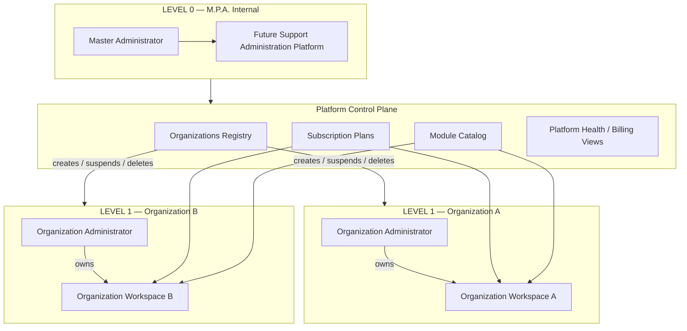

# 03 — Organization Hierarchy

**Package:** AUTH-001  
**Status:** Draft — Awaiting Approval

---

## Hierarchy diagram

---

## Level 0 — M.P.A. Internal

### Actors

| Actor | Description |
|-------|-------------|
| **Master Administrator** | Platform operator with `master_admin` capability |
| **Support Administration Platform** *(future)* | Dedicated tooling UX over the same control plane |

### Responsibilities (allowed)

| Action | Notes |
|--------|-------|
| Create organizations | Manual exception path; primary path is purchase → auto-provision |
| Suspend / reactivate organizations | Billing, abuse, compliance |
| Delete organizations | Soft-delete window then irreversible tombstone |
| Recover Organization Administrator accounts | Identity verification required |
| Issue initial Org Admin credentials | Or re-issue after recovery |
| Assign / change subscription plans | Coordinated with BILL-001 |
| Enable / disable modules | Entitlement overrides with audit |
| View platform health | ADMIN-003 |
| View billing metrics | BILL-001 / ADMIN-003 |

### Responsibilities (forbidden)

| Forbidden | Reason |
|-----------|--------|
| Create day-to-day subaccounts inside customer orgs after onboarding | Customer ownership |
| View or retrieve plaintext passwords | Impossible by design |
| Impersonate without documented audit controls | ADMIN-001 |
| Silently change usernames | Username immutability |
| Move data between organizations | Isolation invariant |

---

## Level 1 — Organization Administrator

### Provisioning

Automatically created when subscription payment succeeds (or Level 0 manual provision).

### Dashboard assignment

| Subscription / org type | Automatic dashboard |
|-------------------------|---------------------|
| Property Owner SKU | Owner Dashboard |
| Property Management Company SKU | Property Manager Dashboard |

Users never choose dashboards.

### Responsibilities (allowed)

Create, edit, disable, archive, unlock, reset password, assign roles/permissions/properties for all subaccounts **inside their organization**.

### Responsibilities (forbidden)

| Forbidden | Reason |
|-----------|--------|
| Access another organization | Isolation |
| Elevate to Level 0 / `master_admin` | Hierarchy |
| Recover themselves via self-serve forgot-password | Ownership protection ([16](./16-recovery-workflows.md)) |
| Change their own username | Immutability |

---

## Control plane vs tenant plane

| Plane | Data | Operators |
|-------|------|-----------|
| **Control plane** | Orgs registry, plans, modules, platform audits | Level 0 |
| **Tenant plane** | Properties, users, leases, docs, money ops | Level 1 + subaccounts |

Level 0 enters tenant plane only through audited support tools (impersonation / recovery), never as a standing org member for daily work.
