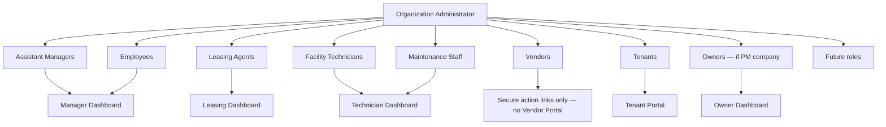

# 04 — User Hierarchy

**Package:** AUTH-001  
**Status:** Draft — Awaiting Approval

---

## Diagram



---

## Principal classes inside an organization

| Class | Created by | Recovered by | Typical plane |
|-------|------------|--------------|---------------|
| Organization Administrator | System at purchase / Level 0 | **M.P.A. Level 0** (+ emergency contact path) | PM or Owner (by org type) |
| Staff subaccounts | Org Admin | Org Admin | PM organization |
| Owner subaccounts | Org Admin (PM org) | Org Admin | Owner plane |
| Tenant subaccounts | Org Admin / leasing workflows | Org Admin | Tenant plane |
| Vendors (not authenticated users) | Directory + secure action links | N/A (no portal session) | Tokenized `/v/[token]` only |

---

## Cardinality rules

| Rule | MVP |
|------|-----|
| Primary Organization Administrator | Exactly **one** per organization |
| Secondary Recovery Contact | At least **one** required before org can leave setup (see [17](./17-emergency-recovery.md)) |
| Co-admins | Optional delegated role with subset of admin capabilities; **does not** replace primary ownership |
| Subaccounts | Unlimited subject to plan entitlements |

---

## Subaccount creation inputs (Org Admin)

Org Admin provides:

1. Display name  
2. Contact email  
3. Role  
4. Permissions (or role default)  
5. Assigned properties / scopes (as role requires)  

System automatically:

1. Generates username  
2. Creates temporary password (hashed)  
3. Sends invitation / welcome email  
4. Places principal in `pending` / `temporary_issued` state  

User then logs in and completes first-login gate.

---

## Elevation bans

```
Subaccount ↛ Organization Administrator (self-serve)
Subaccount ↛ master_admin
Organization Administrator ↛ master_admin
Membership in Org A ↛ data in Org B
```

Role upgrades inside an org require Org Admin (or Level 0 for Org Admin transfer). All elevation events are audited.

---

## Multi-role note

A single principal may hold multiple roles **within one org** only if product policy allows (e.g., staff who is also an owner). Active role/surface is resolved by rules in [07](./07-dashboard-assignment-rules.md), not by free user selection.
