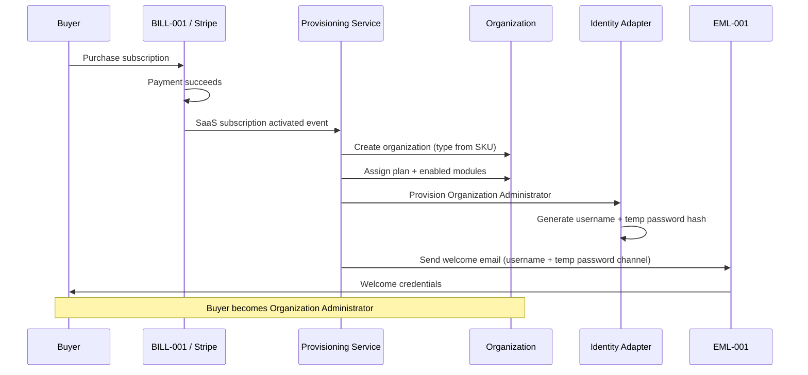

# 05 — Subscription Activation Workflow

**Package:** AUTH-001  
**Status:** Draft — Awaiting Approval

---

## Purpose

Define the commercial handoff from **BILL-001 payment success** to **AUTH-001 organization + Org Admin provisioning**.

AUTH-001 does not own Stripe Checkout. It consumes a verified activation event.

---

## Happy path

---

## Activation inputs (from billing)

| Input | Source | Required |
|-------|--------|----------|
| `saas_subscription_id` | BILL-001 | ✔ |
| `plan_code` | BILL-001 | ✔ |
| `module_entitlements[]` | Plan catalog | ✔ |
| `organization_type` | SKU mapping | ✔ |
| `buyer_legal_name` | Checkout / form | ✔ |
| `buyer_contact_email` | Checkout | ✔ |
| `buyer_company_name` | Checkout | ✔ |
| `billing_customer_id` | Stripe SaaS customer | ✔ |
| `idempotency_key` | Webhook event id | ✔ |

---

## Activation outputs

| Output | Consumer |
|--------|----------|
| `organization_id` | Entire platform |
| `organization_state = pending_activation` | Guards |
| `org_admin_principal_id` | Auth |
| `username` | Welcome email + login |
| `temporary_password` | Delivered once via secure email channel; stored hashed only |
| `provisioning_audit_event` | Compliance |

---

## Idempotency

Provisioning **must** be idempotent on billing event id / subscription id:

| Replay case | Result |
|-------------|--------|
| Same success event twice | No second org; return existing binding |
| Payment succeeded then webhook retry | Same Org Admin; no duplicate welcome spam (or single resend policy) |
| Payment failed | No organization created |

---

## Failure handling

| Failure | Behavior |
|---------|----------|
| Org create fails | Mark activation `failed`; alert Level 0; do not leave orphan subscription without ops queue |
| Username generation collision | Retry with suffix algorithm; alert if exhausted |
| Email send fails | Org + credentials still exist; enqueue retry; Org Admin recoverable by Level 0 |
| Partial write | Compensating transaction or saga; never expose half-created org as `active` |

---

## Manual Level 0 activation

Master Admin may create an organization and issue Org Admin credentials for:

- Founder / complimentary plans  
- Sales-assisted onboarding  
- Disaster recovery rebuilds  

Same provisioning service path; `source = master_admin` audited.
