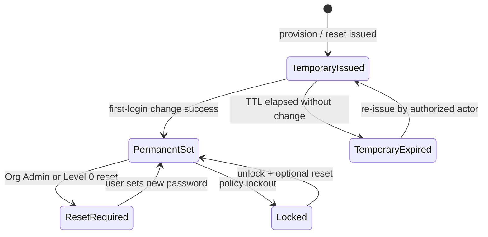

# 10 — Password Lifecycle

**Package:** AUTH-001  
**Status:** Draft — Awaiting Approval

---

## Principles

1. Passwords are **always hashed** (provider/adapter); plaintext never stored.  
2. Temporary passwords are **single-consumption** and expire forever after replacement.  
3. No M.P.A. employee can view passwords.  
4. Password change / reset always audited for privileged accounts.

---

## States

---

## Temporary password

| Rule | Value |
|------|-------|
| Entropy | High; system-generated |
| Delivery | Once via secure email (or Level 0 secure channel) |
| Storage | Hash + metadata only |
| TTL | Short (design default: 72 hours; Approve may set) |
| Reuse | Never; each re-issue creates a new secret |
| After success | Mark consumed; previous temp invalid forever |

---

## First-login password change

Required steps before accessing product surfaces:

1. Authenticate with username + temporary password  
2. Identity verification  
3. Accept Terms  
4. Create new password meeting policy  
5. Optional MFA  
6. `password_state → permanent_set`  
7. Revoke other sessions  

---

## Password policy (proposed)

| Rule | Proposed MVP |
|------|--------------|
| Minimum length | 12 |
| Complexity | Block common passwords; encourage passphrase |
| History | Disallow last N passwords |
| Breach check | Recommended (Have I Been Pwned-style) |
| Max age | Optional; not forced MVP |
| Lockout | Progressive delay / lock after N failures |

Align with [14 Security Standards](../14-security-standards/index.md); AUTH-001 may harden beyond current defaults at Implement.

---

## Reset authority matrix

| Account | Who may reset | Self-serve forgot password? |
|---------|---------------|------------------------------|
| Organization Administrator | **M.P.A. Level 0 only** (+ emergency contact verification path) | **No** |
| Subaccount | Organization Administrator | Optional secondary assist only if product later Approves; default **No** (Org Admin handles) |
| Level 0 Master Admin | Break-glass dual control (future) | Out of band |

---

## Hashing & secrets

| Secret | Handling |
|--------|----------|
| Password | Provider hash only |
| Temporary password plaintext | Memory + email send; never DB; never logs |
| Reset tokens | Single-use, short TTL, hashed at rest if stored |
| MFA seeds | Encrypted at rest |

---

## On password change

Always:

- Invalidate temporary credentials  
- Rotate refresh sessions  
- Emit audit event  
- Notify primary email of security change
