# 14 — Professional Implementation Workflow

**Package:** AUTH-001  
**Status:** Draft — Awaiting Approval

---

## Goal

Offer subscribers a human-led path where **M.P.A. implementation specialists** configure the platform on the customer’s behalf, while **ownership remains with the Organization Administrator**.

Specialists do **not** become day-to-day operators of the customer org after handoff.

---

## When chosen

Org Admin selects **Professional Implementation** in the Setup Wizard ([12](./12-organization-setup-wizard.md)).

---

## High-level flow

```mermaid
flowchart LR
  A[Org Admin chooses Professional] --> B[Implementation request created]
  B --> C[Specialist assigned]
  C --> D[Kickoff + data collection]
  D --> E[Configure under audited access]
  E --> F[Org Admin review checkpoints]
  F --> G[Org Admin Finish Setup]
  G --> H[Organization Active]
  H --> I[Specialist access revoked / time-boxed]
```

---

## Access model for specialists

| Approach | Design stance |
|----------|---------------|
| Standing membership in customer org | **Discouraged** as default |
| Time-boxed implementation grant | **Preferred** |
| ADMIN-001 impersonation of Org Admin | Allowed only with audit + customer acknowledgment |
| Level 0 control-plane tools | For org flags/modules only |

All specialist actions that mutate tenant data must be audited with `actor_type = implementation_specialist`.

---

## Responsibilities

### M.P.A. Implementation Specialist

- Collect rent rolls / docs securely  
- Perform imports and configuration  
- Configure branding, notifications, payment connections with Org Admin present for provider OAuth  
- Invite initial staff **as requested by Org Admin**  
- Prepare activation checklist  

### Organization Administrator

- Remains legal/commercial owner  
- Approves checkpoints  
- Provides recovery contact  
- Clicks **Finish Setup** (cannot be skipped by specialist alone — design default)  
- Manages users after handoff  

---

## Checkpoints (minimum)

1. Company profile confirmed  
2. Portfolio import confirmed  
3. Payments connection confirmed  
4. Recovery contact verified  
5. Initial team invites confirmed  
6. Go-live / Finish  

---

## Handoff

On activation:

- Implementation grant expires  
- Org Admin receives “You’re live” summary  
- Support switches to standard channels  
- No standing specialist user remains unless customer contracts ongoing managed service (**future SKU**, separate Approve)

---

## Switch to AI path

If customer abandons Professional mid-flight, wizard may offer AI Guided continuation with preserved progress.
