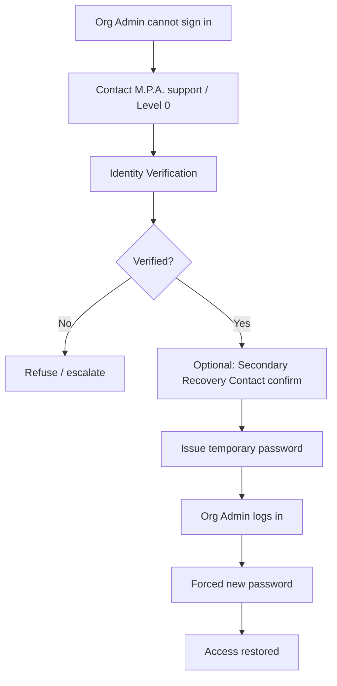

# 16 — Recovery Workflows

**Package:** AUTH-001  
**Status:** ✅ Approved with Amendments · Slice E ✅ **AUTHORIZED** ([47](./47-slice-e-authorization.md)) · Implement within Slice E scope only  
**Support routing:** [30 — Support escalation levels](./30-support-escalation-levels.md)

---

## Split of responsibility

| Account class | Recovery owner |
|---------------|----------------|
| Organization Administrator | **M.P.A. Level 0 only** |
| Subaccounts | **Organization Administrator only** |
| Level 0 break-glass | Dual-control future procedure |

This protects organization ownership from email-inbox takeover of the subscriber.

---

## Organization Administrator — Forgot Password

### Identity verification (minimum)

Level 0 must collect/verify a combination appropriate to risk:

- Organization legal name + username  
- Verified primary contact email challenge  
- Billing last-4 / SaaS customer correlation  
- Secondary Recovery Contact approval ([17](./17-emergency-recovery.md))  
- Government/business documentation when high risk  

Self-serve email “forgot password” for Org Admin is **forbidden** in MVP commercial policy.

---

## Subaccount recovery

Handled entirely by Organization Administrator:

Examples:

- Reset Tenant Password  
- Reset Vendor Password  
- Reset Technician Password  
- Reset Employee Password  

Flow:

1. Org Admin selects user  
2. Issues temporary password / reset  
3. System emails subaccount  
4. Subaccount completes first-login-style password change  
5. Temp expires forever  
6. Audit event recorded  

No M.P.A. support required for routine subaccount lockouts.

---

## Organization recovery (ownership)

Scenarios:

| Scenario | Path |
|----------|------|
| Org Admin lost credentials | Level 0 Org Admin recovery |
| Org Admin departed company | Level 0 transfer to new primary after legal verification |
| Org Admin malicious lockout of others | Level 0 + recovery contact |
| Entire org compromised | Suspend → investigate → recover → force password resets |

Transfer of primary Org Admin:

1. Verify requesting party authority  
2. Verify recovery contact  
3. Provision or promote new Org Admin  
4. Demote/disable previous  
5. Rotate secrets / sessions  
6. Full audit trail  

---

## What support must never do

- Email or chat plaintext long-lived passwords  
- Disable audit logging  
- Recover without verification  
- Create shadow users for convenience without customer ownership clarity
