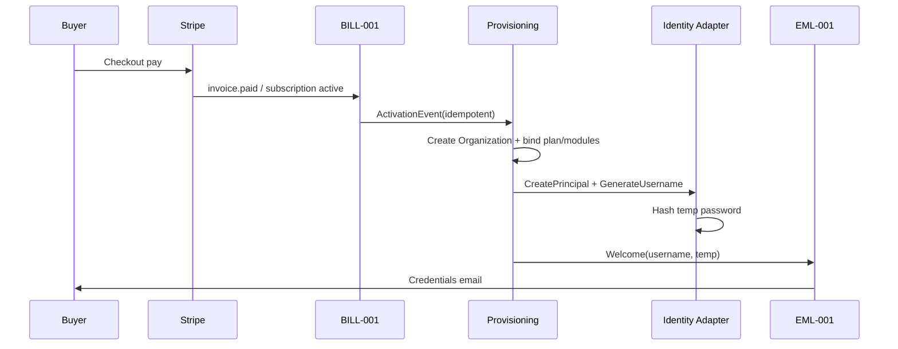
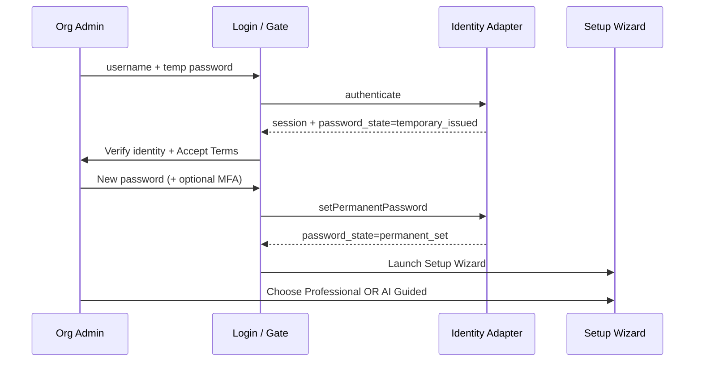
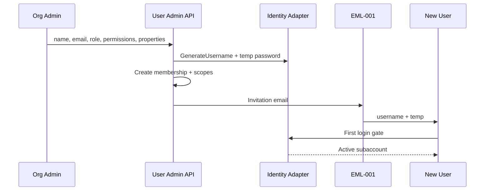
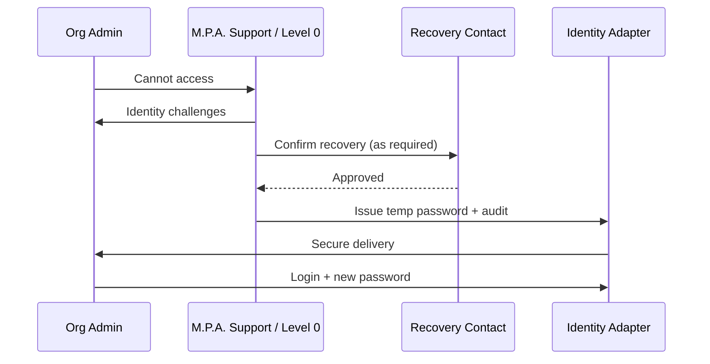
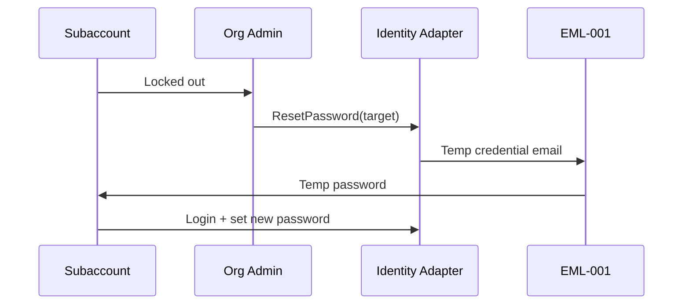
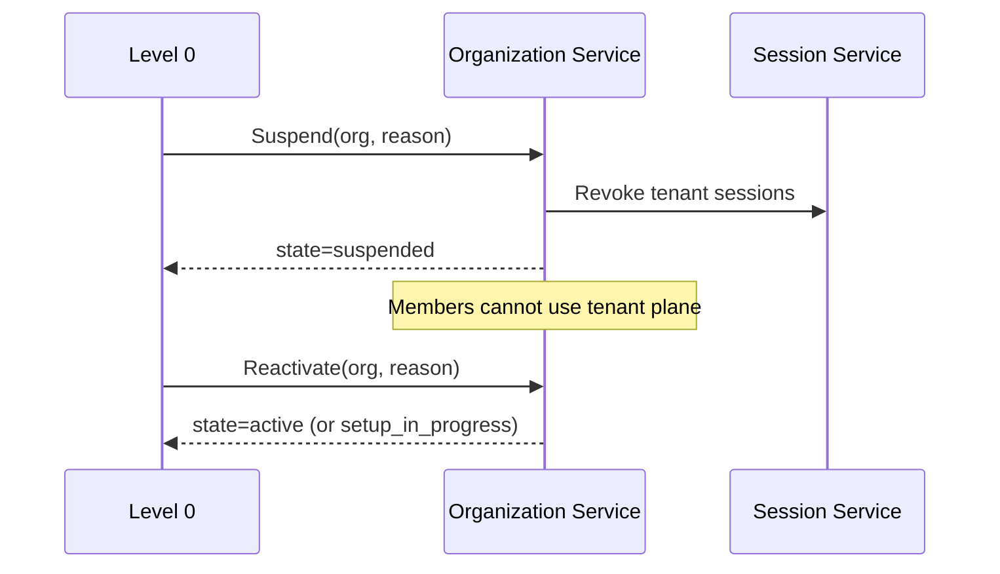
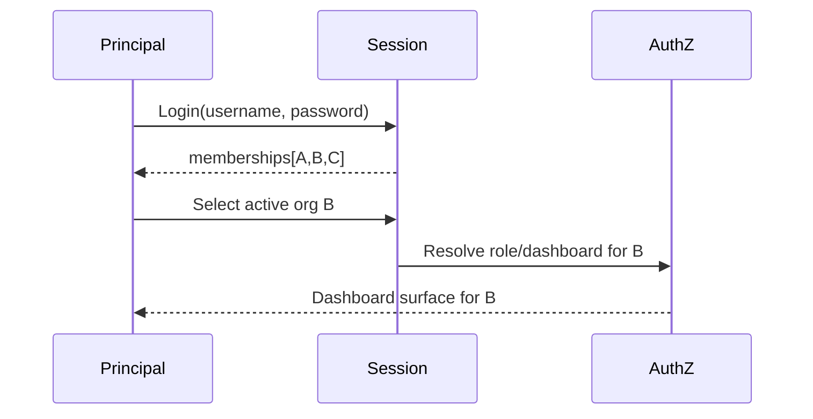

# 21 — Sequence Diagrams

**Package:** AUTH-001  
**Status:** Draft — Awaiting Approval

---

## 1) Subscription → Org Admin provisioned

---

## 2) First login + Setup Wizard start

---

## 3) Subaccount creation

---

## 4) Org Admin recovery (Level 0)

---

## 5) Subaccount password reset

---

## 6) Organization suspension / reactivation

---

## 7) Multi-org session switch (future UX)

