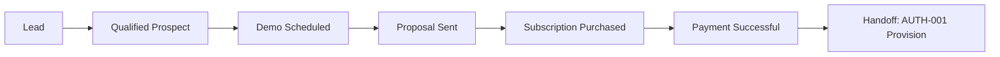

# 02 — Sales-to-Customer Workflow

**Package:** COM-001  
**Status:** Draft — Awaiting Approval

---

## Purpose

Define the path from first contact to Payment Successful — the moment AUTH-001 provisioning is allowed to run.

---

## Happy path



---

## Roles

| Role | Responsibility |
|------|----------------|
| **SDR / Lead Owner** | Qualify, book demo |
| **Account Executive (AE)** | Demo, propose, close |
| **Solutions / SE** | Complex demo / technical fit |
| **Finance** | Non-standard pricing approval |
| **Billing Ops** | Checkout / invoice exceptions |
| **System** | Idempotent activation event after payment |

---

## Stage playbooks (summary)

### Lead capture

**Inputs:** name, email, company, portfolio size, source, consent  
**SLA:** first human touch within commercial SLA (default 1 business day)  
**Exit to Qualified:** ICP checklist pass  

### Qualification (BANT-style)

| Signal | Example |
|--------|---------|
| Need | Active PM pain / switching |
| Portfolio | Units/properties in range for a plan |
| Authority | Decision maker or path to one |
| Timing | Buy window known |

Fail → Nurture sequence (not a customer org).

### Demo

- Use **demo/sandbox** org — never the future customer production org  
- Capture plan recommendation + implementation preference (Professional vs AI)  
- Exit: Proposal Sent  

### Proposal

Must include:

1. Plan code + term (monthly/annual)  
2. Limits summary (properties, units, users, AI, storage)  
3. Modules included  
4. Implementation option + timeline expectation  
5. Price / coupon / founder terms if any  
6. Expiry date  

### Purchase

- Primary self-serve: Public pricing → Stripe Checkout (BILL-001) for Trial / Professional / Business ([ACQ-001](../115-acq-001-self-service-customer-acquisition/README.md) · [A10](./43-amendment-a10-self-service-acquisition.md))  
- Sales-assisted: AE sends Checkout link or Master Admin founder grant + Checkout  
- Enterprise: Contact Sales / Demo — **no** public Enterprise Checkout  
- **No** “create free account” that skips payment / Trial Checkout success + COM-001 activation  

### Parallel self-serve spine

```
Visitor → ACQ public site → Checkout → Payment Successful
  → Org Created → Org Admin → Setup → Active
```

Sales spine ([17](./17-sales-pipeline.md)) remains for Enterprise and assisted deals.
### Payment Successful → handoff packet

Activation event must carry ([AUTH-001 05](../109-auth-001-organization-provisioning-authentication/05-subscription-activation-workflow.md)):

| Field | Required |
|-------|----------|
| `saas_subscription_id` | ✔ |
| `plan_code` | ✔ |
| `organization_type` | ✔ |
| `buyer_contact_email` | ✔ |
| `buyer_company_name` | ✔ |
| `implementation_preference` | ✔ (or default AI Guided) |
| `sales_owner_id` | ✔ |
| `idempotency_key` | ✔ |

---

## Lost / stalled paths

| Situation | Action |
|-----------|--------|
| No-show demo | Reschedule ×2 then nurture |
| Proposal expired | Regenerate or close lost |
| Checkout abandoned | Sales + email recovery; no org created |
| Payment failed | Retry; remain non-customer |
| Founder grant | Master Admin audited; still emits activation |

---

## Explicit bans

- Creating production Organization before Payment Successful  
- Sharing demo credentials as “the customer login”  
- **Free** public signup / create-account without Checkout or Trial activation success  
- Public Enterprise Checkout (must be sales-assisted)  
- Sales creating tenant users inside customer orgs after go-live  
