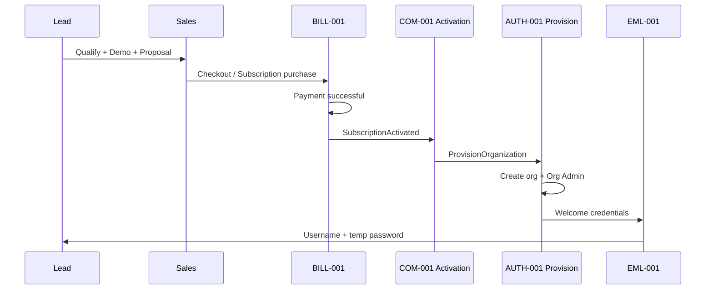
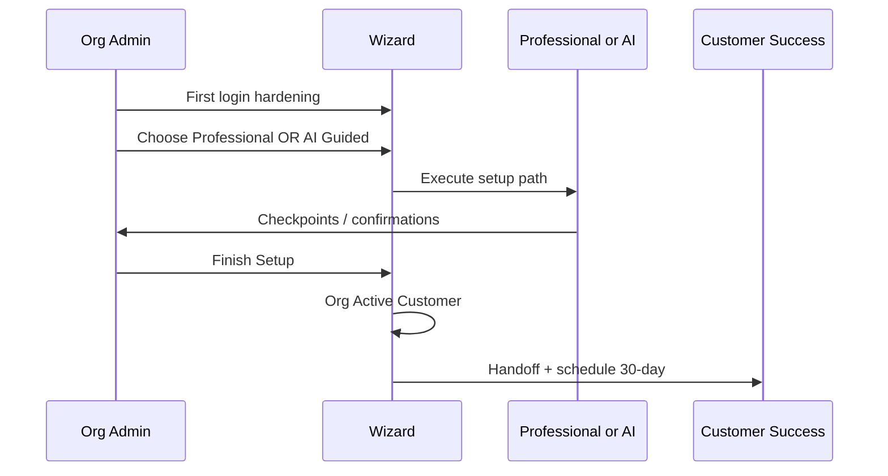
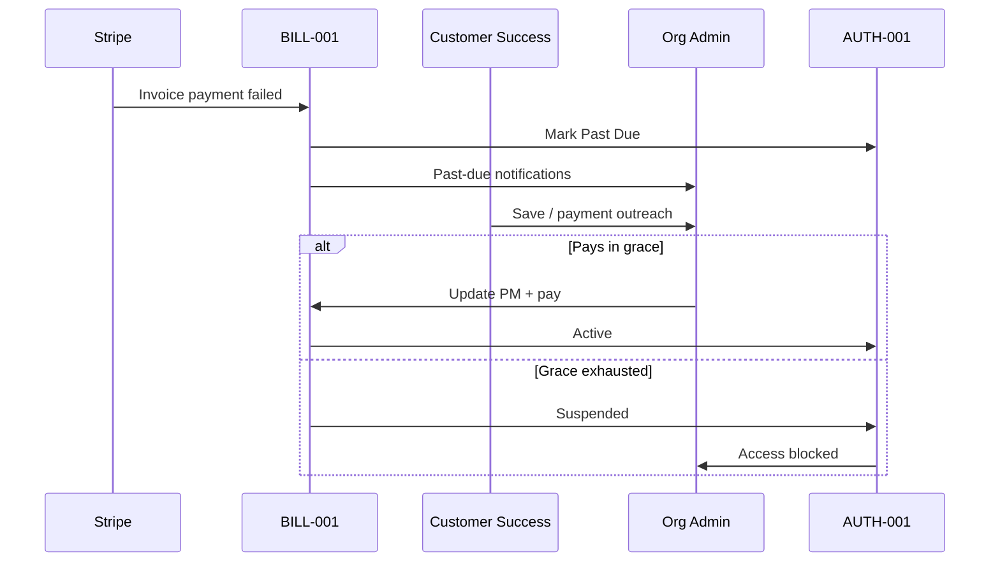
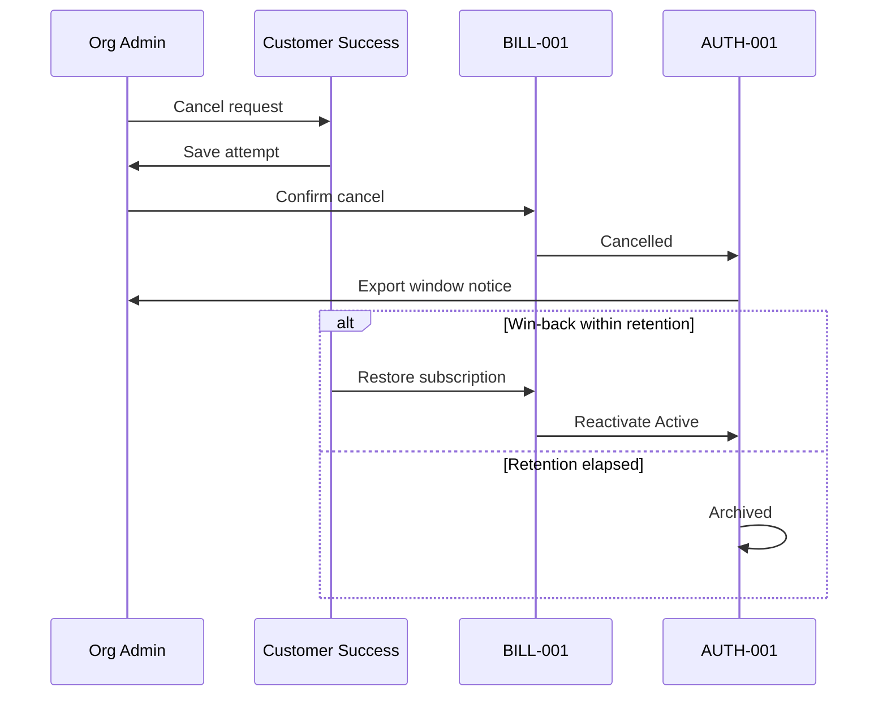
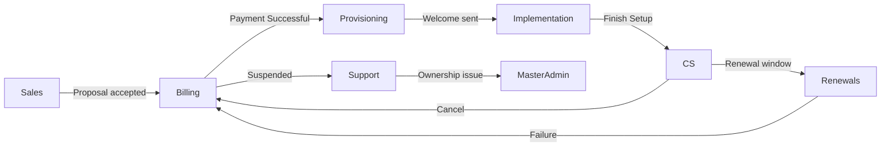

# 10 — Commercial Sequence Diagrams

**Package:** COM-001  
**Status:** Draft — Awaiting Approval

---

## 1) Lead → Payment Successful → Provision



---

## 2) Setup Wizard → Active Customer



---

## 3) Past Due → Grace → Suspended / Restore



---

## 4) Renewal

```mermaid
sequenceDiagram
  participant Sys as Automation
  participant CS as Customer Success
  participant OA as Org Admin
  participant BILL as BILL-001

  Sys->>OA: T-90 / T-30 / T-7 reminders
  CS->>OA: Assisted renew (if tier)
  BILL->>BILL: Renewal charge
  alt Success
    BILL->>OA: Receipt; Active continues
  else Failure
    BILL->>OA: Past Due path
  end
```

---

## 5) Cancel → Archive / Reactivate



---

## 6) Cross-team handoff bus (logical)


