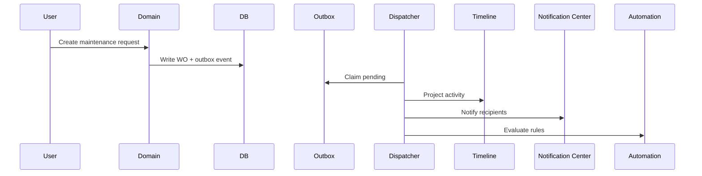
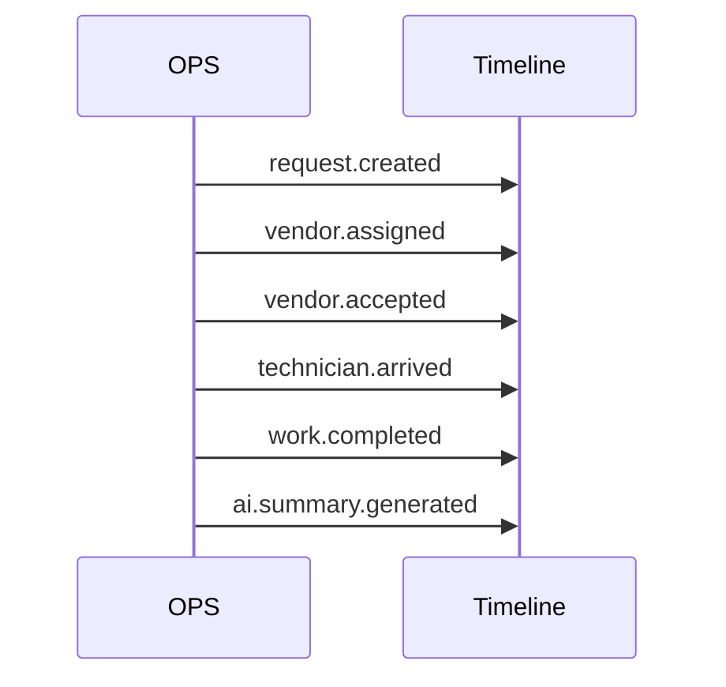
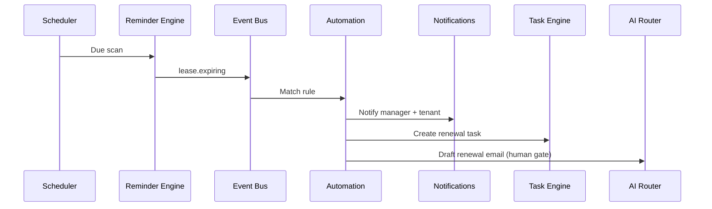
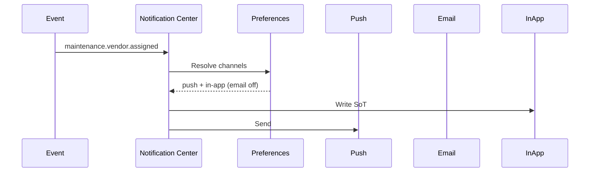
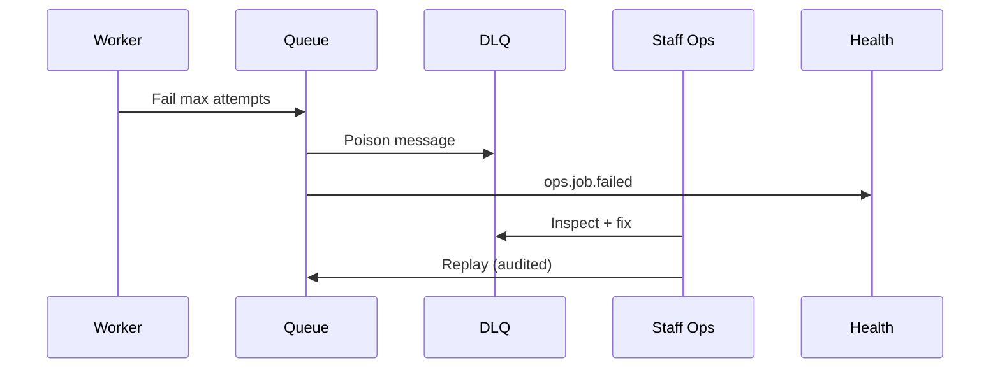
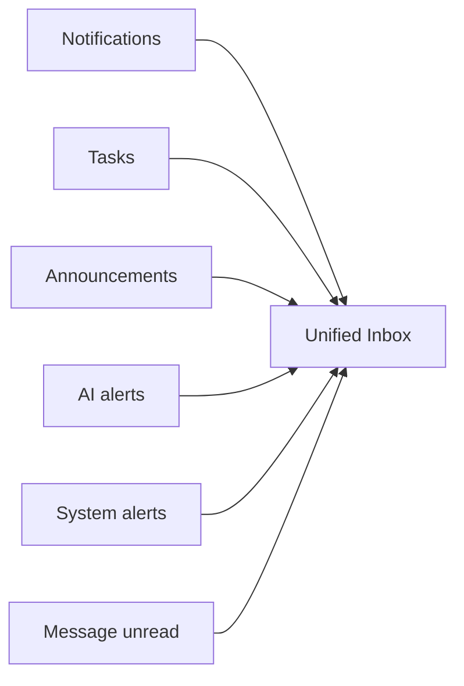

# 15 — Sequence Diagrams

**Package:** OPS-001  
**Status:** Draft — Awaiting Approval

---

## 1) Domain mutation → outbox → fan-out

---

## 2) Maintenance lifecycle on timeline

---

## 3) Lease expiry automation

---

## 4) Notification preferences

---

## 5) Failure → DLQ → replay

---

## 6) Unified Inbox aggregation

