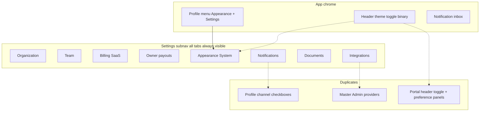
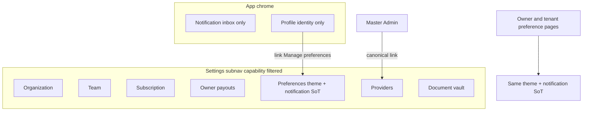

# 36 — Amendment A09: Settings Information Architecture Consolidation

**Package:** UX-012  
**Amendment ID:** A09  
**Status:** ✅ **Approved**  
**Date:** 2026-07-28 · **Approved:** 2026-07-28  
**Scope:** Settings IA for Version 1.0 (ops shell + portal preference alignment)  
**Gate:** Design → Document → Approve → Implement  
**Policy:** [Implementation Gate](../00-governance/implementation-gate.md) · [ADR-012](../18-decision-log/adr-012-design-document-approve-implement.md)  
**Does not authorize by itself:** silent code without a follow-on implement slice/PR citing this approval

> **Approved.** Implementation may proceed only in scoped PRs that cite `APPROVE UX-012 AMENDMENT A09` and stay within §10 migration notes (IA/nav/prefs consolidation — no module workflow redesign).

---

## 1. Executive Summary

Ops Settings today is an **eight-tab catch-all**: every signed-in user sees every pill, many routes hard-redirect to `/unauthorized`, theme and notifications have **duplicate entry points and conflicting stores**, and labels like **Billing** collide with rent collections and owner payouts.

This amendment establishes a **Version 1.0 Settings Information Architecture** that:

- Cuts duplicate preference surfaces (theme, notifications)
- Filters Settings navigation by **capability**
- Clarifies money naming (SaaS vs property money)
- Preserves approved product philosophy and existing module workflows (no redesign of billing, COM, onboarding, or vault logic)

**Binding intent:** One Settings IA, one theme SoT, one notification-preference SoT, capability-visible tabs only.

---

## 2. Current IA Assessment

### 2.1 Ops Settings tabs (as shipped)

| Tab | Route | Purpose today | Gate (page) | Subnav visible? |
|-----|-------|---------------|-------------|-----------------|
| Organization | `/settings/organization` | Org identity **plus** COM-001 lifecycle cards | `organization:read` | Always |
| Team | `/settings/team` | Members, invites, recovery contact | `membership:read` or `invitation:read` | Always |
| Billing | `/settings/billing` | **MPA SaaS** subscription (BILL-001) | `saas:read` | Always |
| Owner payouts | `/settings/payouts` | Stripe Connect settlement / payout runs (FIN-003) | `payout:manage` or `financial:read`/`financial:admin` | Always |
| Appearance | `/settings/appearance` | Light / Dark / System | None | Always |
| Integrations | `/settings/integrations` | Provider health probes | None | Always |
| Documents | `/settings/documents` | Org Document Vault | `document:read` | Always |
| Notifications | `/settings/notifications` | Channel/category prefs + PWA install | None | Always |

Subnav source: `apps/web/src/components/settings/settings-subnav.tsx` — **unfiltered**.

### 2.2 Documented duplication

| Area | Surfaces today | Conflict |
|------|----------------|----------|
| **Theme** | Header `ThemeModeToggle` (ops + portals); Settings → Appearance; Owner settings; Tenant preferences; Profile menu → Appearance; Master Admin HQ links | Header is **binary** light↔dark; Appearance panel is Light/Dark/**System**. Header can override System silently. UX-012 Q2: toggle **in settings**. |
| **Notifications (prefs)** | Settings → Notifications (`NotificationPreferencesForm` → `/api/resident/preferences`); Profile form email/in_app/sms on `user_profiles.notification_preferences`; Owner settings; Tenant preferences | **Two preference stores** with overlapping channel controls; Profile is a second system. |
| **Notifications (inbox)** | Header Notification Center; tenant `/portal/tenant/notifications` | Inbox ≠ preferences (keep separate; not prefs SoT). |
| **Integrations** | `/settings/integrations` and `/master-admin/providers` both render `ProviderStatusCenter` | Dual entry, same UI. |
| **Money naming** | Settings **Billing** (SaaS) vs Financials rent billing vs **Owner payouts** | Customers cannot tell “pay M.P.A.” from “collect rent / pay owners.” |
| **Team / setup** | Settings → Team and `/setup` (invites + recovery) | Post-setup overlap (note only; setup redesign out of scope). |
| **Documents** | Settings vault; Financials reports → vault; owner/tenant document portals | Different scopes OK; ops label is vague. |
| **Organization** | Identity form + commercial lifecycle stack on one page | Overloaded but **workflow redesign out of scope** for V1.0 — keep content, clarify purpose in IA. |

### 2.3 Philosophy fit (gaps)

| Principle | Gap |
|-----------|-----|
| Reduce duplicate functionality | Theme + notification prefs duplicated |
| One source of truth | Two notification stores; binary vs System theme |
| Capability-based navigation | Tabs shown without capability |
| Orgs only see what they can use | `/unauthorized` dead-ends from Settings |
| Reduce clicks | Extra Appearance + Profile preference paths |

---

## 3. Proposed Version 1.0 Settings IA

### 3.1 Ops Settings tab set (capability-filtered)

**Six primary tabs** (down from eight equal-weight pills). Appearance and Notifications merge into **Preferences**. Labels updated per §7. Module workflows unchanged.

| Order | Label (V1.0) | Route (stable) | Purpose | Who sees it | Required capability | Source of truth | Why here |
|-------|--------------|----------------|---------|-------------|---------------------|-----------------|----------|
| 1 | **Organization** | `/settings/organization` | Org identity + approved commercial lifecycle surfaces | Org operators with org read | `organization:read` (manage: `authorization:manage` where applicable) | `organizations` + COM-001 surfaces | Company-level admin home |
| 2 | **Team** | `/settings/team` | Members, invites, roles, recovery contact | Users who can see memberships or invites | `membership:read` **or** `invitation:read` | Membership / invitation services | People administration |
| 3 | **Subscription** | `/settings/billing` | M.P.A. SaaS plan, invoices, cancel-at-period-end, usage | SaaS readers | `saas:read` (manage: `saas:manage`) | BILL-001 / `saas_*` | Pay-for-platform SoT (not rent) |
| 4 | **Owner payouts** | `/settings/payouts` | Connect settlement, owner roster, payout runs | Financial / payout operators | `payout:manage` **or** `financial:read` **or** `financial:admin` | FIN-003 | Owner money movement ≠ SaaS |
| 5 | **Preferences** | `/settings/preferences` *(logical)* · may keep `/settings/notifications` + `/settings/appearance` as section anchors until implement | Theme + notification channels/categories/quiet hours + PWA install coaching | Any authenticated ops user in an org context | Authenticated + active org (no special capability) | Theme: §4 · Notifications: §5 | One personal-settings home |
| 6 | **Workspace** | Logical grouping **or** two filtered tabs: **Providers** + **Document vault** | Provider health; org document vault | Providers: org members with `organization:read` **or** Master Admin · Vault: `document:read` | Integrations page probes · Document vault ACL | Ops tooling that is not “personal preference” |

**V1.0 navigation presentation (binding):**

- Show **Organization · Team · Subscription · Owner payouts · Preferences · Providers · Document vault** as filtered pills **only when the user has the capability** (Providers and Document vault remain separate pills if both entitled — still fewer *visible* tabs for most roles than today).
- **Do not** show Appearance and Notifications as separate top-level tabs once Preferences ships.
- Until Preferences is implemented, treat Appearance + Notifications as the interim Preferences pair and still apply capability filtering to money/team/docs tabs.

**Out of Settings subnav (still valid elsewhere):**

| Surface | Rule |
|---------|------|
| Master Admin `/master-admin/providers` | Non-canonical deep link → **redirect or “Open Providers”** to Settings Providers SoT after Approve+Implement |
| Profile `/profile` | Identity/avatar/timezone/memberships only — **no** second notification prefs UI |
| Financials | Rent collections remain outside Settings (ADR-024 / BILL-001 separation) |
| Header Notification Center | Inbox only |

### 3.2 Portal alignment (no portal redesign)

| Role | Preference home | Rule |
|------|-----------------|------|
| Owner | `/portal/owner/settings` | Embed same Preferences composition (theme + notification prefs SoT) |
| Tenant | `/portal/tenant/preferences` | Same |
| Profile menu “Appearance” | Resolve to **role-appropriate Preferences** (ops → Preferences; owner/tenant → their preference page) — not a hard-coded ops Appearance URL for portal users |

---

## 4. Theme Source of Truth

| Question | Binding answer (V1.0) |
|----------|----------------------|
| Where is theme changed? | **Preferences → Appearance** (ops Settings Preferences; owner/tenant preference pages). Single control: Light / Dark / **System**. |
| Should System mode remain? | **Yes** — matches branding standards (user preference + system) and current Appearance panel. |
| Should the header toggle exist? | **No** for V1.0. Remove always-visible `ThemeModeToggle` from ops and portal chrome (aligns UX-012 Q2: toggle in settings). Reduces conflict with System. |
| How should portals behave? | Same three-way control on portal Preferences; **no** chrome toggle. |
| Cross-device sync? | V1.0: **device-local** persistence (existing cookie + localStorage theme sync). Cross-device account sync is **out of scope** (future note). |
| Density? | Unchanged — role-defaulted; no user density toggle (Q7). |

**Authoritative store (runtime):** existing theme preference keys / cookies (`mpa:theme-preference` / related). No parallel theme UI state.

---

## 5. Notification Source of Truth

| Layer | Authoritative? | Action for V1.0 IA |
|-------|----------------|--------------------|
| `NotificationPreferencesForm` + `/api/resident/preferences` (channels, categories, quiet hours, push flags) | **Yes — preference SoT** | Own Settings → Preferences (and portal preference pages) |
| Profile `user_profiles.notification_preferences` (email / in_app / sms checkboxes) | **No** | Remove from Profile UI; do not maintain a second system. Link: “Manage notification preferences” → Preferences |
| Header / tenant notification inbox | Delivery UI | Keep; not a preference editor |
| Master Admin push diagnostics | Ops tooling | Keep under Master Admin; not Settings Preferences |
| PWA install / push enrollment coaching | Enrollment UX | Belongs under Preferences (with notification prefs), not a separate Settings tab |

**Conflict rule:** If Profile JSON and preferences API disagree, **preferences API wins**. Profile fields become legacy until a later data migration (implement note only).

---

## 6. Capability-Based Navigation Rules

1. **Filter before link** — Settings subnav renders only tabs the user is entitled to open.
2. **No Settings → `/unauthorized`** — If a tab is not entitled, it is **absent**, not clickable-then-forbidden.
3. **Default landing** — `/settings` redirects to the first **visible** tab for that user (today: org-first / MA appearance-first). Preserve org-first for portfolio operators; MA-only may land on Preferences.
4. **Direct URL** — Deep links to an entitled route still work; unentitled deep links may show a calm empty/forbidden page **without** advertising other forbidden tabs in the subnav.
5. **Master Admin** — May see Providers via Settings SoT; HQ catalog links must target the canonical Providers route after consolidation.
6. **Capability map (visibility):**

| Tab | Visible when |
|-----|----------------|
| Organization | `organization:read` |
| Team | `membership:read` **or** `invitation:read` |
| Subscription | `saas:read` |
| Owner payouts | `payout:manage` **or** `financial:read` **or** `financial:admin` |
| Preferences | Authenticated with active org (or MA-only shell equivalent) |
| Providers | `organization:read` **or** Master Admin HQ role |
| Document vault | `document:read` |

---

## 7. Naming Recommendations

Labels only — **no** functional change to rails or APIs.

| Current | V1.0 label | Rationale |
|---------|------------|-----------|
| Billing | **Subscription** | Distinguishes M.P.A. SaaS from rent collections on Financials |
| Owner payouts | **Owner payouts** | Already clear; keep |
| Integrations | **Providers** | Status of platform providers, not “connect Zapier” expectation |
| Documents | **Document vault** | Org vault vs owner/tenant document portals |
| Appearance + Notifications | **Preferences** | One personal-settings home |
| Organization / Team | Unchanged | Clear |

Supporting copy (implement later): one-line subtitles under Subscription (“Your M.P.A. plan”) and Owner payouts (“Send owner distributions”) remain allowed without renaming modules.

---

## 8. Before / After Navigation Diagram

### Before (ops)



### After (V1.0 target)



---

## 9. Acceptance Criteria

| ID | Criterion |
|----|-----------|
| SIA-01 | Documented Settings tab set ≤ current eight equal pills; Preferences replaces separate Appearance + Notifications at IA level |
| SIA-02 | Theme SoT is Preferences three-way control; header theme toggle is **not** part of V1.0 IA |
| SIA-03 | Notification preference SoT is the preferences API / shared form; Profile does not own a second prefs system |
| SIA-04 | Capability-filtered Settings nav is specified; Settings must not present tabs that only lead to `/unauthorized` |
| SIA-05 | SaaS billing labeled **Subscription**; rent/collections remain outside Settings |
| SIA-06 | Providers has one canonical ops Settings home; MA duplicate is non-canonical |
| SIA-07 | Portal preference pages align to the same theme + notification SoTs (no chrome theme toggle) |
| SIA-08 | No module workflow redesign required to meet this IA (BILL-001, FIN-003, COM-001, vault ACL unchanged) |
| SIA-09 | Implementation may proceed only via scoped work citing **APPROVE UX-012 AMENDMENT A09** |

---

## 10. Migration / Implementation Notes

**Future work only — not authorized by this document.**

1. **Nav filter** — Capability-aware Settings subnav; hide unentitled tabs; fix `/settings` redirect to first visible tab.
2. **Rename labels** — Subscription, Providers, Document vault (routes may stay `/settings/billing`, `/settings/integrations`, `/settings/documents` initially).
3. **Preferences composition** — Single page/sections for theme + notification prefs + PWA install; deprecate standalone Appearance/Notifications top-level pills.
4. **Remove chrome `ThemeModeToggle`** from ops + portal shells after Preferences is discoverable.
5. **Profile** — Replace notification checkboxes with link into Preferences; leave API fields untouched until a dedicated prefs migration package.
6. **MA Providers** — Redirect or deep-link to Settings Providers SoT.
7. **Profile menu Appearance** — Point to role-correct Preferences URL.
8. **Copy pass** — One-line clarifiers under Subscription vs Owner payouts.
9. **Do not** merge SaaS Subscription with Financials rent billing; do not redesign COM cards on Organization; do not change Stripe Portal/Checkout flows.
10. **Authorize** via explicit follow-on slice / PR citing **APPROVE UX-012 A09**.

### Implementation status (2026-07-28)

Shipped in app (cite A09): capability-filtered Settings subnav; Preferences page (theme + notifications + PWA); Appearance/Notifications redirects; Subscription / Providers / Document vault labels; header/portal theme toggle removed; Profile prefs link; MA Providers → Settings Providers; deep-link helpers updated.

---

## Approval

| Role | Decision | Date | Notes |
|------|----------|------|-------|
| Product | **APPROVE** | 2026-07-28 | Binding phrase: `APPROVE UX-012 AMENDMENT A09` |
| UX / Chief Product Designer | **APPROVE** | 2026-07-28 | Same binding approval |
| Lead Architect | **APPROVE** | 2026-07-28 | Same binding approval |

**Binding phrase recorded:**

```
APPROVE UX-012 AMENDMENT A09
```

**Implement unlocked** for work scoped to this amendment (§10). Cite A09 on implementing PRs.
