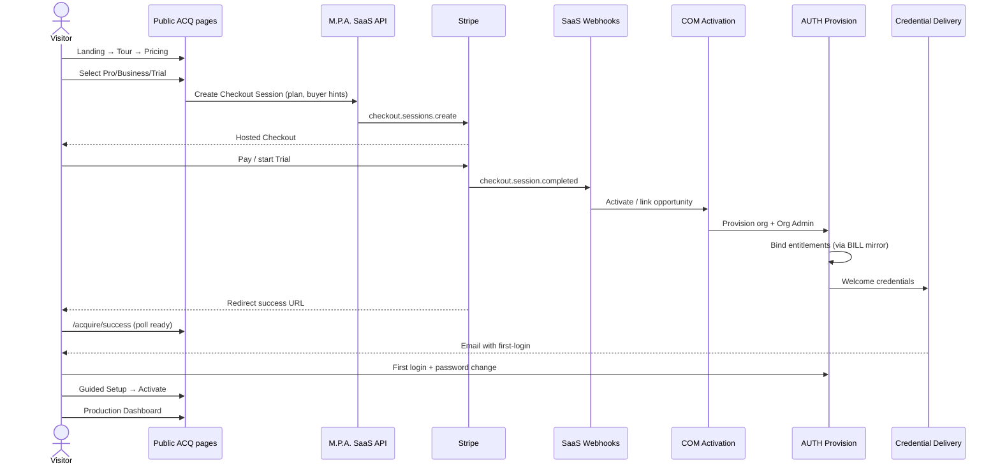
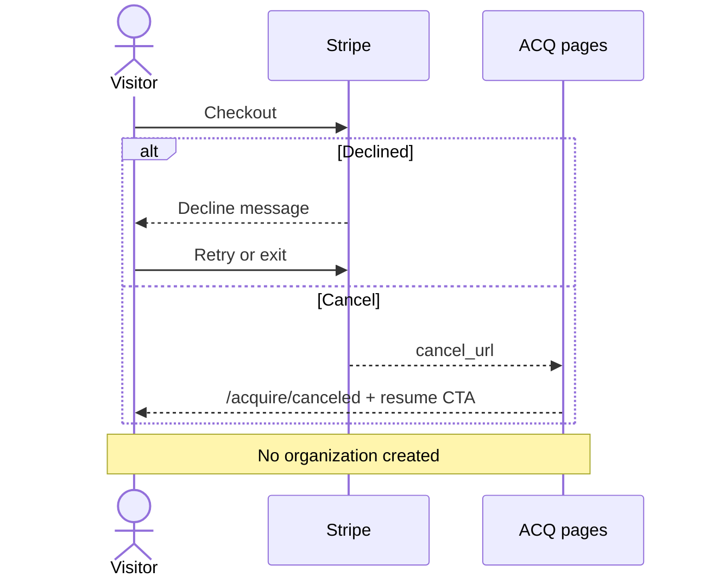
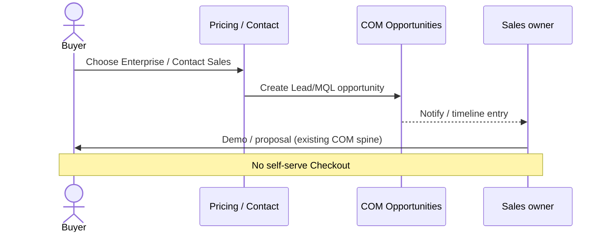
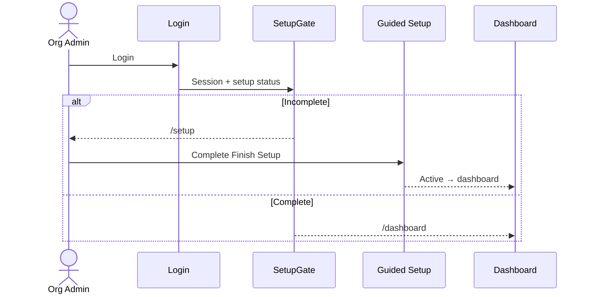

# 13 — Sequence Diagrams

**Package:** ACQ-001  
**Status:** Draft — Ready for Approval

---

## S1 — Happy path: public purchase → dashboard

---

## S2 — Payment failure / cancel

---

## S3 — Enterprise contact sales

---

## S4 — Resume incomplete setup

