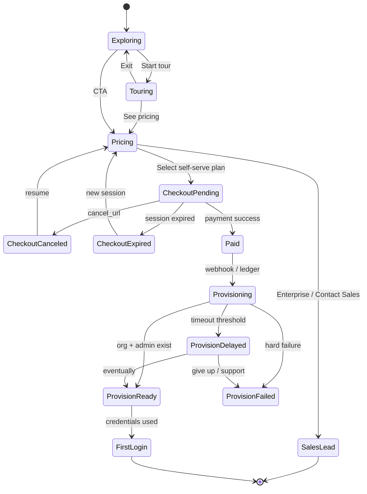
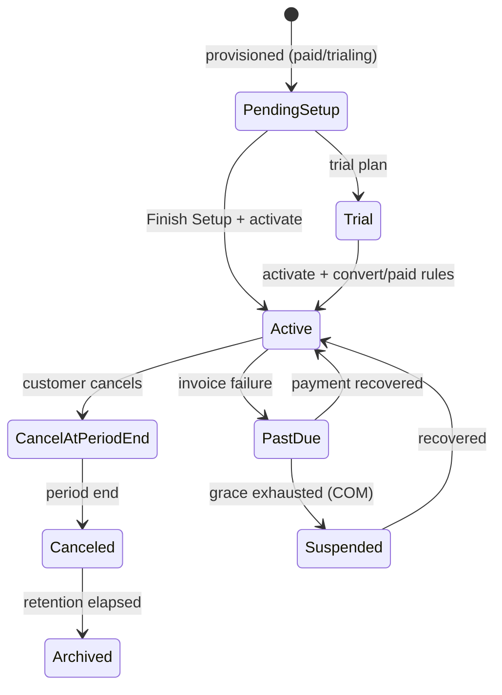
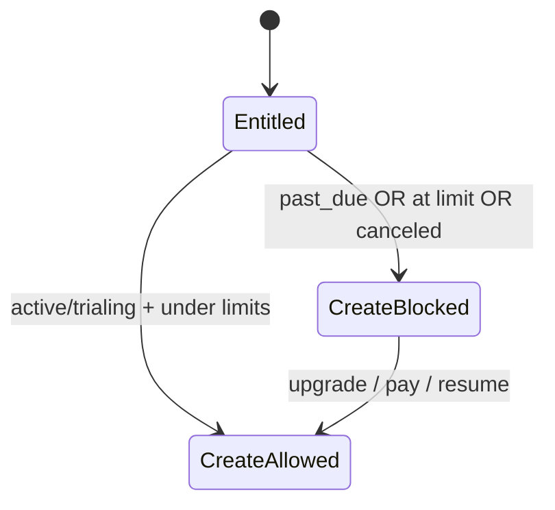

# 14 — State Diagrams

**Package:** ACQ-001  
**Status:** Draft — Ready for Approval

---

## Acquisition session states (public)

---

## Organization commercial / setup states (post-purchase)

Aligns with AUTH org commercial lifecycle + Guided Setup Finish Setup:

---

## Entitlement enforcement overlay

