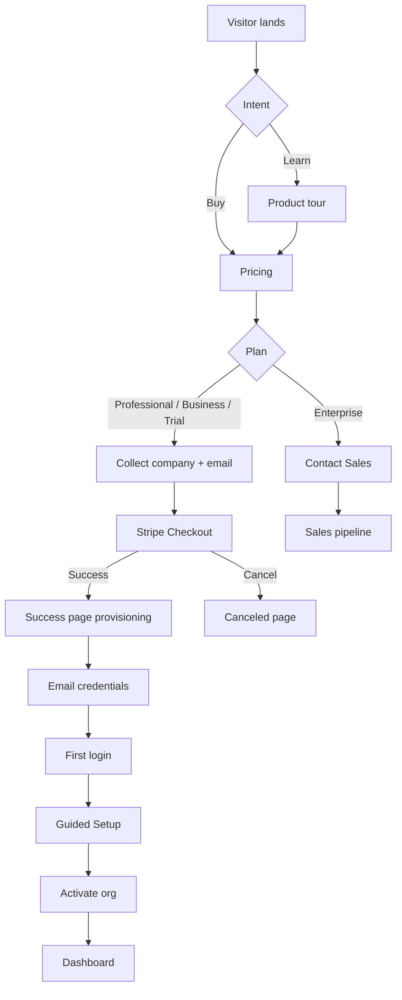
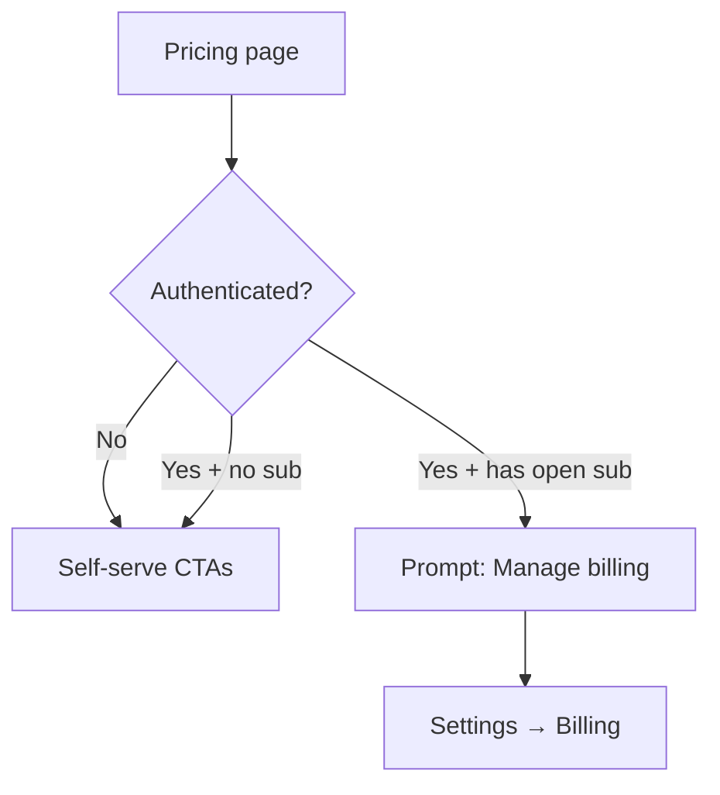
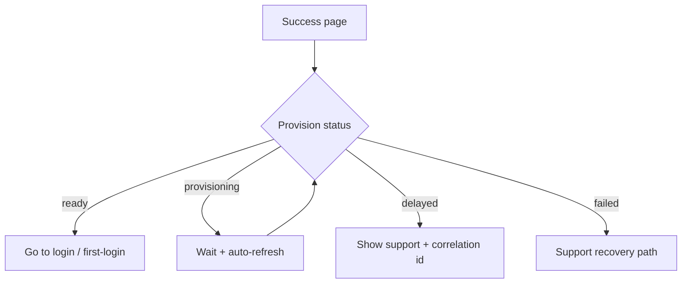

# 15 — User Flow Diagrams

**Package:** ACQ-001  
**Status:** Draft — Ready for Approval

---

## F1 — Self-serve Professional purchase

---

## F2 — Existing customer hits pricing

---

## F3 — Error recovery (provision delayed)

