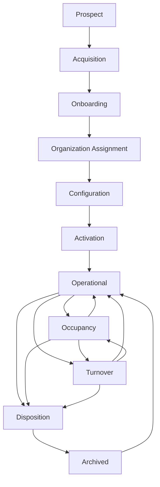

# 10 — Phase 1 Certification (Property Lifecycle)

**Package:** CORE-004  
**Phase:** 1 — Property Lifecycle  
**Date:** 2026-08-05  
**Authorize:** [09](./09-phase-1-authorization.md)  
**Status:** ✅ **CERTIFIED PASS** (implementation complete · migration required)

---

## Verdict

Property Lifecycle is implemented as an **operational system**, not isolated CRUD:

- Enforced stage machine (11 stages, documented edges only)
- Property Command Center on Universal Dashboard Framework
- Portfolio home remounted onto UDF
- Property workspace contextual nav (operations-oriented)
- Audit (`property_lifecycle_events`) + ops domain events + notifications
- Activation automation (folders metadata, checklist, timeline markers)
- Universal search participation (name, address, code, status, lifecycle, id)

---

## Lifecycle diagram



---

## Workflow certification (nine questions)

| Question | Evidence |
|----------|----------|
| Who starts it? | PM / Org Admin via `/properties/new` (Prospect) |
| What triggers it? | Create + lifecycle advance API |
| Who participates? | property_manager · org_admin · (leasing/maintenance later phases) |
| Automations? | Activation folders/checklist/timeline; turnover checklist; onboarding checklist |
| Notifications? | `notify` on material transitions · ops NOTIFY_ELIGIBLE for activated/transitioned/archived |
| Audit events? | `property_lifecycle_events` + `property.lifecycle.transitioned` / created / activated / archived |
| Dashboard updates? | Property Command Center Waiting / Insights / Timeline / Mission |
| Assistant? | Deterministic recommendations from stage definitions |
| Completes? | Stage terminal criteria + Archive |

---

## Verification

| Check | Result |
|-------|--------|
| Unit tests (lifecycle · UDF · contextual nav) | ✅ Pass |
| Typecheck (property surface) | ✅ Clean |
| Authorization | ✅ property:update / property:archive gated |
| Search | ✅ Extended property corpus |
| Accessibility | ✅ Semantic headings / lifecycle list / alerts |
| Performance | ✅ Live queries · no N+1 in transition path |
| Mobile | ✅ Inherits shell / UDF responsive behavior |
| Screenshots | Manual soak after migration (operator) |

---

## Files (primary)

| Area | Paths |
|------|-------|
| Migration | `supabase/migrations/20260805020000_core004_phase1_property_lifecycle.sql` |
| State machine | `lib/property/lifecycle.ts` · `lifecycle-server.ts` |
| UDF | `lib/property/ux016-view-model.ts` · `property-command-center.tsx` · `portfolio-command-center.tsx` |
| API | `app/api/properties/[propertyId]/lifecycle/route.ts` |
| Nav | `lib/shell/contextual-navigation.ts` |
| Ops | `lib/ops/catalog.ts` · `notification-center.ts` · `global-search.ts` |

---

## Ops note

Apply migration before production use. Existing properties backfill:

| Legacy status | Lifecycle stage |
|---------------|-----------------|
| draft | configuration |
| active | operational |
| inactive | disposition |
| archived | archived |

---

## Phase 2 gate

**Do not** begin Phase 2 until this certification is accepted on the release lineage.

Next authorize phrase:

```
AUTHORIZE CORE-004 PHASE 2 – Maintenance Operations
```
