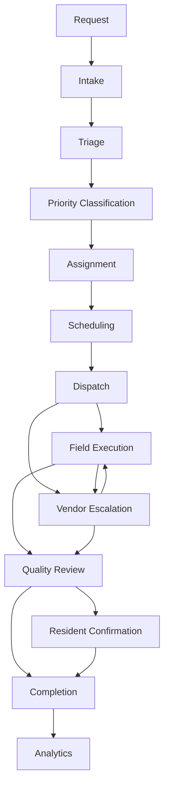

# 14 — Phase 2 Certification (Maintenance Operations)

**Package:** CORE-004  
**Phase:** 2 — Maintenance Operations  
**Date:** 2026-08-05  
**Authorize:** [12](./12-phase-2-authorization.md) · Design [13](./13-phase-2-design.md)  
**Status:** ✅ **CERTIFIED PASS** (implementation complete · migration required)

---

## Verdict

Maintenance Operations is implemented as a **complete operational workflow**, not isolated features:

- Single canonical state machine (13 stages; documented edges only)
- All entry points converge on `workflow_stage` (resident · manager · create · emergency automation)
- Maintenance Command Center on Universal Dashboard Framework (STD-001 — no custom dashboard)
- Property Command Center / Timeline / Assistant / Notifications / Analytics integration without duplicate tracking
- Resident confirm + feedback path (no internal ops exposure)
- Technician mobile-first day view (greeting · route · emergency · parts · next job · checklist)
- Audit (`maintenance_workflow_events`) · ops domain events · notifications · search
- Permanent rule enforced: **one canonical state machine**

---

## End-to-end workflow diagram

---

## Workflow certification (nine questions)

| Question | Evidence |
|----------|----------|
| Who starts it? | Resident (`/portal/tenant/maintenance/new`), PM/coordinator (`/maintenance/new`), inspection/PM automation via `createWorkOrder` |
| What triggers it? | Create WO → `workflow_stage=request` (or assignment/completion when seeded); emergency automation advances intake→priority |
| Who participates? | Resident · Property Manager · Maintenance Coordinator · Technician · Vendor · Org Admin · Master Admin (View As/Test only) |
| Automations? | Emergency intake chain; completion → analytics metadata; ops events on transition/complete |
| Notifications? | `notify` on material stages · ops `maintenance.workflow.transitioned` / `maintenance.work.completed` |
| Audit events? | `maintenance_workflow_events` append-only + activity timeline |
| Dashboard updates? | Maintenance Command Center Waiting / Attention / Mission / Insights |
| Assistant? | Stage definitions seed Waiting on Me/Others + recommendations |
| Completes? | Quality → (Resident Confirm?) → Completion → Analytics (terminal) |

---

## Role actions (summary)

| Role | Primary actions |
|------|-----------------|
| Resident | Submit · track · receive updates · confirm · feedback |
| Property Manager / Coordinator | Intake→dispatch · assign · QA · finalize |
| Technician | Field execution · photos · checklist · next job |
| Vendor | Escalate path · existing tokenized job documents/invoices |
| Org Admin | Full ops within org capabilities |
| Master Admin | View As / Test Mode only (MAC-002) |

---

## Verification

| Check | Result |
|-------|--------|
| Unit tests (`workflow` · Maintenance UDF) | ✅ Pass |
| Typecheck (maintenance workflow surfaces) | ✅ Clean for Phase 2 changes |
| Authorization | ✅ `maintenance:update` / `assign` gated; resident confirm ownership-checked |
| Notifications | ✅ Stage notify + emergency priority mapping |
| Timeline | ✅ Workflow events + property facility timeline reuse |
| Assistant | ✅ Waiting on Me/Others from stage defs + queues |
| Dashboard | ✅ STD-001 Maintenance Command Center |
| Property integration | ✅ Open maintenance count on Property Command Center |
| Audit | ✅ `maintenance_workflow_events` |
| Search | ✅ Maintenance corpus includes workflow_stage |
| Accessibility | ✅ Semantic headings · alerts · aria labels on workflow/confirm |
| Performance | ✅ Indexed `(organization_id, workflow_stage)` · no N+1 on transition |
| Mobile | ✅ Resident portal + technician day view responsive |
| Regression | ✅ Workflow transition graph tests · UDF emergency surface |
| Screenshots | Manual soak after migration (operator) |

---

## Files (primary)

| Area | Paths |
|------|-------|
| Migration | `supabase/migrations/20260805030000_core004_phase2_maintenance_workflow.sql` |
| State machine | `lib/maintenance/workflow.ts` · `workflow-server.ts` |
| UDF | `lib/maintenance/ux016-view-model.ts` · `maintenance-command-center.tsx` |
| API | `app/api/maintenance/[workOrderId]/workflow` · `resident-confirm` |
| Resident | `portal/tenant/maintenance/*` · `resident-confirmation-panel.tsx` |
| Technician | `facility/technician-dashboard.*` · `/facility` |
| Property | `property/ux016-view-model.ts` open-maintenance signals |
| Ops / search | `ops/catalog.ts` · `notification-center.ts` · `global-search.ts` |

---

## Ops note

Apply migration before production use. Existing work orders backfill `workflow_stage` from legacy `status`.

---

## Gate

| Stage | Status |
|-------|--------|
| Design | ✅ |
| Document | ✅ |
| Authorize | ✅ |
| Implement | ✅ |
| Verify / Certify | ✅ **PASS** |
| Accept | Awaiting `ACCEPT CORE-004 PHASE 2` before Phase 3 Authorize |

**Do not request Phase 3 authorization until Phase 2 is accepted.**
