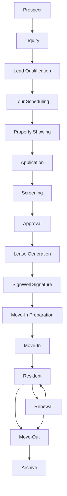

# 18 — Phase 3 Certification (Leasing Operations)

**Package:** CORE-004  
**Phase:** 3 — Leasing Operations  
**Date:** 2026-08-05  
**Authorize:** [16](./16-phase-3-authorization.md) · Design [17](./17-phase-3-design.md)  
**Status:** ✅ **CERTIFIED PASS** (implementation complete · migration required)

---

## Verdict

Leasing Operations is implemented as a **complete operational workflow**, not isolated CRUD:

- Single canonical state machine (16 stages; documented edges only)
- Dual carriers, one machine: `applicants.workflow_stage` (prospect→approval) · `leases.workflow_stage` (lease_generation→archive)
- All entry paths converge on `workflow_stage` (manual · import · legacy status backfill · approval automation · SignWell webhook)
- Leasing Command Center on Universal Dashboard Framework (STD-001 — no custom dashboard)
- Property Command Center leasing pipeline signal · Timeline · Assistant · Notifications · Search · Audit
- SignWell is the only signature path (`advanceLeasingAfterSignWell` from certified signature advance)
- Permanent rule enforced: **one canonical leasing lifecycle**

---

## End-to-end workflow diagram

---

## State transition matrix

| From | Allowed next |
|------|----------------|
| prospect | inquiry |
| inquiry | lead_qualification |
| lead_qualification | tour_scheduling |
| tour_scheduling | property_showing |
| property_showing | application |
| application | screening |
| screening | approval |
| approval | lease_generation |
| lease_generation | signwell_signature |
| signwell_signature | move_in_preparation |
| move_in_preparation | move_in |
| move_in | resident |
| resident | renewal, move_out |
| renewal | resident, move_out |
| move_out | archive |
| archive | _(terminal)_ |

Authoritative definitions (entry/exit/roles/approvals/notifications/automation/audit/timeline/Assistant/Waiting/dashboard): `apps/web/src/lib/lease/workflow.ts`.

---

## Workflow certification (nine questions)

| Question | Evidence |
|----------|----------|
| Who starts it? | Website/phone/referral/manual/import → applicant carrier at `prospect`; existing resident renewal on lease carrier |
| What triggers it? | Create applicant/lease seeds `workflow_stage`; approval automation → lease_generation→signwell_signature; SignWell completion → move_in_preparation |
| Who participates? | Prospect · Applicant · Leasing Agent · Property Manager · Resident · Org Admin · Master Admin (View As/Test only) |
| Automations? | `runApprovalToLeaseAutomation` · `advanceLeasingAfterSignWell` · ops `leasing.workflow.transitioned` |
| Notifications? | `notify` category `leases` on material stages |
| Audit events? | `leasing_workflow_events` append-only + ops domain event |
| Dashboard updates? | Leasing Command Center Waiting / Attention / Mission / Insights (STD-001) |
| Assistant? | Stage definitions seed Waiting on Me/Others + recommendations |
| Completes? | Move-Out → Archive (terminal) |

---

## Role actions (summary)

| Role | Primary actions |
|------|-----------------|
| Prospect / Applicant | Inquiry · application · documents · SignWell · move-in tasks |
| Leasing Agent | Qualify · tour/show · advance application · prepare lease |
| Property Manager | Approvals · renewals · move-out · exceptions |
| Resident | Renewal / move-out participation after move-in |
| Org Admin | Org policy / override entitlements |
| Master Admin | View As / Test Mode only (MAC-002) |

---

## Verification

| Check | Result |
|-------|--------|
| Unit tests (`workflow` · Leasing UDF) | ✅ Pass |
| Typecheck (leasing workflow surfaces) | ✅ Clean for Phase 3 changes |
| Authorization | ✅ `lease:update` / `applicant:update` gated on workflow APIs |
| SignWell integration | ✅ `workflow-advance` → `advanceLeasingAfterSignWell` only |
| Notifications | ✅ Stage notify · category `leases` · ops event registered |
| Timeline | ✅ Workflow events + existing applicant/lease timelines |
| Assistant | ✅ Waiting on Me/Others from stage defs + command center |
| Dashboard | ✅ STD-001 Leasing Command Center |
| Property integration | ✅ Active leasing count on Property Command Center |
| Audit | ✅ `leasing_workflow_events` |
| Search | ✅ Leases + applicants corpora include `workflow_stage` · renewals/expirations |
| Accessibility | ✅ Semantic headings · alerts · aria labels on workflow panel / command center |
| Performance | ✅ Indexed `(organization_id, workflow_stage)` · no N+1 on transition |
| Mobile | ✅ Workflow panel + UDF home responsive (same STD-001 shells) |
| Regression | ✅ Transition graph tests · UDF SignWell/screening surfaces |
| Screenshots | Manual soak after migration (operator) — before/after: legacy status-only lease/applicant detail → Leasing Workflow panel + STD-001 Leasing Command Center |

---

## Files (primary)

| Area | Paths |
|------|-------|
| Migration | `supabase/migrations/20260805040000_core004_phase3_leasing_workflow.sql` |
| State machine | `lib/lease/workflow.ts` · `workflow-server.ts` |
| Types | `packages/supabase/src/types.ts` (`workflow_stage` · `leasing_workflow_events`) |
| UDF | `lib/lease/ux016-view-model.ts` · `leasing-command-center.tsx` |
| API | `app/api/leases/[leaseId]/workflow` · `app/api/applicants/[applicantId]/workflow` |
| Detail UI | `leasing-workflow-panel.tsx` on lease + applicant detail |
| SignWell | `lib/signature/workflow-advance.ts` → `advanceLeasingAfterSignWell` |
| Property | `property/ux016-view-model.ts` active-leasing signals |
| Ops / search | `ops/catalog.ts` · `notification-center.ts` · `global-search.ts` |

---

## Ops note

Apply migration before production use. Existing applicants/leases backfill `workflow_stage` from legacy `status` / renewal status. Legacy statuses remain synced; **`workflow_stage` is authoritative**.

---

## Gate

| Stage | Status |
|-------|--------|
| Design | ✅ |
| Document | ✅ |
| Authorize | ✅ |
| Implement | ✅ |
| Verify / Certify | ✅ **PASS** |
| Accept | ✅ Accepted — [19](./19-phase-3-acceptance.md) |

Phase 3 is complete. Phase 4 was authorized after Accept.
