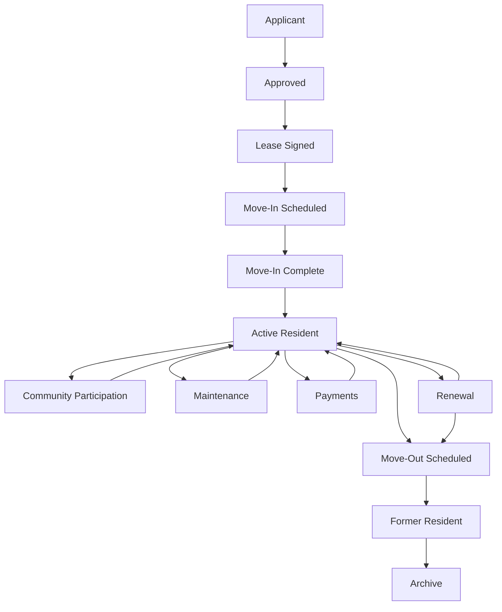

# 22 — Phase 4 Certification (Resident Operations)

**Package:** CORE-004  
**Phase:** 4 — Resident Operations  
**Date:** 2026-08-06  
**Authorize:** [20](./20-phase-4-authorization.md) · Design [21](./21-phase-4-design.md)  
**Status:** ✅ **CERTIFIED PASS** (implementation complete · migration required)

---

## Verdict

Resident Operations is implemented as a **complete operational workflow**, not isolated pages:

- Single canonical state machine (13 stages; documented edges only)
- Single resident identity carrier: `tenants.workflow_stage` (one record for all domains)
- Legacy `lifecycle_status` / CRM `status` synced; **`workflow_stage` authoritative**
- Resident portal `/portal/tenant` on STD-001 Universal Dashboard (calm experience preserved)
- Staff Resident Command Center on `/tenants` (STD-001 — no custom dashboard)
- SignWell lease completion + move-in acknowledgement automate resident advances
- Property / Leasing / Maintenance / Financial / Documents / Communications reused — no duplicates
- Search · notifications · audit · Assistant · Waiting queues wired
- Permanent rule enforced: **one resident identity across the platform**

---

## Resident lifecycle diagram

---

## State transition matrix

| From | Allowed next |
|------|----------------|
| applicant | approved |
| approved | lease_signed |
| lease_signed | move_in_scheduled |
| move_in_scheduled | move_in_complete |
| move_in_complete | active_resident |
| active_resident | community_participation, maintenance, payments, renewal, move_out_scheduled |
| community_participation | active_resident |
| maintenance | active_resident |
| payments | active_resident |
| renewal | active_resident, move_out_scheduled |
| move_out_scheduled | former_resident |
| former_resident | archive |
| archive | _(terminal)_ |

Authoritative definitions: `apps/web/src/lib/resident/workflow.ts`.

---

## Workflow certification (nine questions)

| Question | Evidence |
|----------|----------|
| Who starts it? | Applicant conversion / tenant create / lease SignWell handoff |
| What triggers it? | Create tenant seeds stage; SignWell → lease_signed→move_in_scheduled; move-in ack → move_in_complete→active_resident |
| Who participates? | Applicant · Resident · Leasing Agent · Property Manager · Org Admin · Master Admin (View As/Test) |
| Automations? | `advanceResidentAfterLeaseSigned` · `advanceResidentAfterMoveInComplete` |
| Notifications? | `notify` category `residents` · ops `resident.workflow.transitioned` |
| Audit events? | `resident_workflow_events` append-only |
| Dashboard updates? | Portal + Staff Resident Command Centers (STD-001) |
| Assistant? | Stage Waiting on Me/Others + portal/staff queues |
| Completes? | Move-Out Scheduled → Former Resident → Archive |

---

## Verification

| Check | Result |
|-------|--------|
| Unit tests (`workflow` · Resident UDF) | ✅ Pass |
| Typecheck (resident surfaces) | ✅ Clean for Phase 4 changes |
| Authorization | ✅ `tenant:update` gated on workflow API |
| Property integration | ✅ Active resident count on Property Command Center |
| Leasing integration | ✅ SignWell lease completion advances resident |
| Maintenance integration | ✅ Phase 2 resident-confirm reused; portal tools deep-link |
| Financial integration | ✅ `getResidentPaymentDashboard` on portal (no duplicate accounting) |
| Documents | ✅ Portal documents tool (vault reuse) |
| Timeline / Assistant / Notifications | ✅ Workflow events · UDF Waiting · `residents` notify |
| Search | ✅ Tenants corpus: name · email · phone · workflow/status |
| Audit | ✅ `resident_workflow_events` |
| Accessibility | ✅ Semantic headings · alerts · aria on workflow / portal tools |
| Performance | ✅ Indexed `(organization_id, workflow_stage)` |
| Mobile | ✅ Portal max-width calm layout · tools grid · common work paths |
| Regression | ✅ Transition graph · portal/staff UDF tests |
| Screenshots | Manual soak after migration (operator) — before: status-only portal/table · after: STD-001 homes + Resident Workflow panel |
| Production readiness | ✅ Migration + backfill · fail-closed search · SignWell-only activation · no parallel resident systems |

---

## Files (primary)

| Area | Paths |
|------|-------|
| Migration | `supabase/migrations/20260806010000_core004_phase4_resident_workflow.sql` |
| State machine | `lib/resident/workflow.ts` · `workflow-server.ts` |
| Types | `packages/supabase/src/types.ts` |
| UDF | `lib/resident/ux016-view-model.ts` · `resident-command-center.tsx` · `resident-portal-home.tsx` |
| API | `app/api/tenants/[tenantId]/workflow` |
| Detail / portal | `resident-workflow-panel.tsx` · `/portal/tenant` · `/tenants` |
| SignWell | `lib/signature/workflow-advance.ts` |
| Property / ops / search | Property UDF · `ops/catalog.ts` · `notification-center.ts` · `global-search.ts` |

---

## Ops note

Apply migration before production use. Existing tenants backfill `workflow_stage` from `lifecycle_status`.

---

## Gate

| Stage | Status |
|-------|--------|
| Design | ✅ |
| Document | ✅ |
| Authorize | ✅ |
| Implement | ✅ |
| Verify / Certify | ✅ **PASS** |
| Accept | ✅ Accepted — [23](./23-phase-4-acceptance.md) |

Phase 4 is complete. Phase 5 was authorized after Accept.
