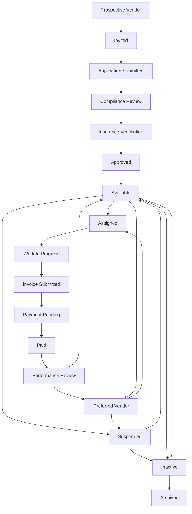

# 26 — Phase 5 Certification (Vendor Operations)

**Package:** CORE-004  
**Phase:** 5 — Vendor Operations  
**Date:** 2026-08-06  
**Authorize:** [24](./24-phase-5-authorization.md) · Design [25](./25-phase-5-design.md)  
**Status:** ✅ **CERTIFIED PASS** (implementation complete · migration required)

---

## Verdict

Vendor Operations is implemented as a **complete operational workflow**, not isolated CRUD:

- Single canonical state machine (17 stages; documented edges only)
- Single vendor identity carrier: `vendors.workflow_stage` (one record for all domains)
- Legacy CRM `status` synced; **`workflow_stage` authoritative**
- STD-001 Vendor Command Center on `/vendors` (no custom dashboard)
- Maintenance assignments + `/v/[token]` mobile job path sync vendor focus stages
- Invoices / payments reuse `vendor-payments` → Financial Operations (no duplicate accounting)
- Property Command Center vendor work + compliance signals
- Search · notifications · audit · Assistant · Waiting queues wired
- Permanent rule enforced: **one canonical Vendor Operations workflow**

---

## Vendor lifecycle diagram

---

## Workflow certification (nine questions)

| Question | Evidence |
|----------|----------|
| Who starts it? | Staff invite / create vendor (`prospective_vendor` / `invited`); application path advances to compliance |
| What triggers it? | Manual panel advances · assignment sync · invoice submit/approve/paid · approved→available automation |
| Who participates? | Org Admin · Property Manager · Vendor (mobile token) · Finance reviewer |
| Automations? | Approved → Available; assignment status → assigned/WIP; invoice submitted → payment_pending → paid → performance_review |
| Notifications? | `notify` on material stages · ops `vendor.workflow.transitioned` |
| Audit events? | `vendor_workflow_events` append-only |
| Dashboard updates? | Vendor Command Center Waiting / Attention / Mission / Insights |
| Assistant? | Stage definitions seed Waiting on Me/Others + recommendations |
| Completes? | Job cycle returns to `available` / `preferred_vendor`; terminal `archived` |

---

## Role actions (summary)

| Role | Primary actions |
|------|-----------------|
| Staff / PM | Onboard · compliance · insurance · approve · assign · review invoice · mark paid · performance |
| Vendor (mobile) | Accept · navigate · photos · documents · communicate · finish · submit invoice |
| Finance | Approve invoice · schedule/pay via Financial Operations |
| Org Admin | Full ops within org capabilities |

---

## Verification

| Check | Result |
|-------|--------|
| Unit tests (`workflow` · Vendor UDF · Property vendor signals) | ✅ Pass |
| Typecheck (vendor workflow surfaces) | ✅ Clean for Phase 5 changes |
| Authorization | ✅ `vendor:read|create|update|archive|delete|assign` gated |
| Maintenance integration | ✅ Assign only when assignable; Phase 2 WO machine unchanged |
| Financial integration | ✅ Invoice events advance payment stages; expenses via existing path |
| Property integration | ✅ Open vendor work + compliance on Property Command Center |
| Documents | ✅ Reuse vault / signed docs / invoice media (no parallel store) |
| Notifications | ✅ Stage notify + ops fan-out eligibility |
| Timeline / Audit | ✅ `vendor_workflow_events` + ops domain events |
| Assistant | ✅ Waiting on Me/Others from stage defs + UDF |
| Search | ✅ Vendor corpus: business_name · trade · insurance · workflow_stage |
| Accessibility | ✅ Semantic headings · alerts · aria on workflow panel / UDF |
| Performance | ✅ Indexed `(organization_id, workflow_stage)` · no N+1 on transition |
| Mobile | ✅ `/v/[token]` accept/start/finish/invoice syncs lifecycle |
| Regression | ✅ Workflow transition graph tests · assignable-stage gate |
| Screenshots | Manual soak after migration (operator) |

---

## Production readiness assessment

| Item | Status |
|------|--------|
| Migration `20260806020000_core004_phase5_vendor_workflow.sql` | Ready to apply |
| Backfill from legacy `status` / `preferred_vendor` | Included |
| No second vendor CRM / maintenance workflow | Enforced |
| STD-001 home only | `/vendors` remounted |
| Stack base | Phase 4 tip |

**Ready for Accept** after operator migration soak.

---

## Files (primary)

| Area | Paths |
|------|-------|
| Migration | `supabase/migrations/20260806020000_core004_phase5_vendor_workflow.sql` |
| State machine | `lib/vendor/workflow.ts` · `workflow-server.ts` |
| UDF | `lib/vendor/ux016-view-model.ts` · `vendor-command-center.tsx` |
| API | `app/api/vendors/[vendorId]/workflow` |
| Detail | `vendor-workflow-panel.tsx` · `/vendors/[vendorId]` |
| Assignments / mobile | `lib/vendor/assignments.ts` · `lib/vendor-jobs/server.ts` |
| Invoices | `lib/vendor-payments/server.ts` |
| Property / ops / search | Property UDF · `ops/catalog.ts` · `notification-center.ts` · `global-search.ts` |
| Types | `packages/supabase/src/types.ts` |

---

## Ops note

Apply migration before production use. Existing vendors backfill `workflow_stage` from `status` / `preferred_vendor`.

---

## Gate

| Stage | Status |
|-------|--------|
| Design | ✅ |
| Document | ✅ |
| Authorize | ✅ |
| Implement | ✅ |
| Verify / Certify | ✅ **PASS** |
| Accept | Awaiting `ACCEPT CORE-004 PHASE 5` before Phase 6 Authorize |

**Do not request Phase 6 authorization until Phase 5 is accepted.**
