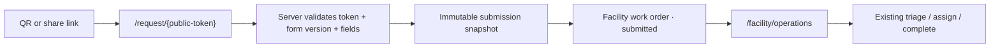

# 204 — Facility Custom Work Request Forms + QR / Link Intake

**Status:** **DESIGN COMPLETE — APPROVAL REQUIRED**  
**Date:** 2026-08-17  
**Gate:** Design → Document → **Approve** → Implement (ADR-012)  
**Mode:** Design / document only. **Do not implement. Do not deploy. Do not create Production data.**  
**SKU:** Facility Operations, and Complete Platform when the member has effective Facility Operations access  
**Predecessor:** [docs/203](../203-docs-202-production-release/index.md) (certified Production line)  
**Related ADR:** [ADR-034](../18-decision-log/adr-034-facility-public-work-request-intake.md) (**Proposed**)  
**Preserves:** ADR-019 product constitution · ADR-020 shared FO work orders · ADR-023 MEDIA-001 · ADR-026 auth pipeline · ADR-033 member operating scope (docs/202)

This package designs a **customizable Facility Operations work-request intake**. Each organization / facility controls the fields requesters must provide. Requests arrive through a **QR code** or a **shareable web link** that both resolve to the **same** public request portal.

This is **not** Property Manager residential maintenance. A similar PM concept would need a separate Owner decision.

---

## Verdict

**DESIGN COMPLETE — APPROVAL REQUIRED**

Recommended operational model:

```
Public / employee request  →  immutable submission snapshot
                           →  one facility work order in submitted
                           →  existing FO lifecycle (triage → assign → complete)
```

Do **not** create a second maintenance system.  
Do **not** hard-code one universal request sheet.  
Do **not** expose internal work-order fields to public requesters.

Exact next action after this record: **Owner Approve** (this document + ADR-034). Until then: **STOP. Do not implement.**

---

## 1. Current FO workflow

Facility Operations already has a certified internal work-order path. It does **not** have a public request portal.

| Today | Behavior |
|---|---|
| Canonical record | `maintenance_work_orders` with `work_surface = 'facility'` (ADR-020). No parallel FO table. |
| Staff create | `/facility/operations` (and category queues) → POST `/api/facility/operations` |
| Required on create | Title, description, building (`property_id`) |
| Optional | Unit, category, priority, asset label / `facility_asset_id`, due date, MEDIA-001 evidence |
| Statuses | `submitted` → `triaged` → `assigned` → `in_progress` → `closed` (facility skips resident confirm) · `cancelled` |
| Assignment | Technician or vendor (`pm.maintenance:assign` is manager-only) |
| Notes | Append-only `maintenance_work_order_updates` |
| Evidence | `media_attachments` (`related_entity_type = 'maintenance'`), private bucket, signed URLs |
| Location | Building = `property_properties`. Floor / room live on `facility_assets`, not on the work order. **Department is not modeled.** |
| Source | **No `source` / intake-channel column.** Internal staff create sets `requested_by_user_id` to the staff actor. |
| Public intake | **None.** All FO create routes require an authenticated member with `facility.operations`. |
| PM analog | Authenticated tenant portal `/portal/tenant/maintenance` creates **residential** work only. Tenants do not upload MEDIA-001 today. |
| Notify on create | **Does not fire.** `maintenance_notifications` starts at triage / assign / progress. |
| FO Settings | Module map lists Settings. Live product has `/settings/organization` and `/settings/team` only. **No `/facility/settings`.** |
| QR | Asset `scan_code` exists as a future hook. **No scanner UX, no public token, no WO QR.** |

Staff today: create internally → triage → assign technician/vendor → attach evidence → progress → close. Requesters who are not M.P.A. members have **no** Facility path.

---

## 2. Identified gap

Different facilities need different request sheets. A clinic furniture form is not a warehouse safety form. Hard-coding one universal sheet would force unused fields on every site and omit the fields that site actually needs.

The missing product is:

1. An admin **Request Form builder** (per organization, multiple forms).
2. A **secure public portal** that does not require an M.P.A. paid account for ordinary Contact Required intake.
3. **QR + shareable link** intake that can carry trusted location / asset context.
4. Immediate appearance in the **existing FO operations queue**, without staff retyping.

This is a Facility Operations (and Complete-in-FO-scope) workflow. It is not a website builder, not a new SKU, and not residential maintenance.

---

## 3. Chosen request / work-order architecture

### Decision

**Immediate work order + immutable submission snapshot.**

A public submit:

1. Validates the active form **version**, intake token, fields, and attachments.
2. Resolves organization / facility **server-side** from the token (the browser never sends `organization_id`).
3. Writes an immutable `facility_request_submissions` row (exact field snapshot + source + context).
4. Creates **one** `maintenance_work_orders` row: `work_surface = 'facility'`, `status = 'submitted'`, `assignee_type = 'unassigned'`.
5. Links them 1:1 (`submissions.work_order_id`).
6. Binds MEDIA to that work order.
7. Emits audit + `work_order.created` and a new staff notification key.

Staff then use the **existing** FO lifecycle. They do not accept, convert, or retype.

### Why not a separate request that staff converts (model B)

| Model B cost | Why it fails the Owner test |
|---|---|
| Two operational records | Request queue **and** work-order queue |
| Accept / convert step | Staff re-entry risk the Owner forbade |
| Split audit | History lives in two places |
| Parallel maintenance system | Conflicts with ADR-020 |

A conversion step is only justified if most submissions should be discarded before they become work. Facility intake is operational work: a broken chair **is** a work order in `submitted`.

### Why not dump fields only onto the work order (pure A)

Custom fields, form versioning, requester status tokens, and QR context would be stuffed into `description` or an untyped JSON column on the work order. That corrupts history when the form later changes and mixes public intake with internal WO fields.

The snapshot table is an **intake receipt**, not a second queue. The operations queue remains `maintenance_work_orders`.



---

## 4. Form builder

### Placement

Consistent with the approved FO module map (`docs/24` Settings) and live IA (no FO settings home yet):

```
Facility Operations
└── Settings
    └── Request Forms
```

**Live route (post-Approve):** `/facility/settings/request-forms`

This is the first Facility-owned settings child. Organization / Team / Billing stay on existing `/settings/*` routes. Do not invent a website-builder area.

Also reachable from Facility Mission Control as a manager action: **Request Forms**.

### Who

Authorized Facility admins / managers (`organization_admin` or `property_manager` with effective FO access). See §19.

### What a form has

| Customer field | Purpose |
|---|---|
| Name | Example: Furniture / Maintenance Request |
| Description / instructions | Shown on the public portal |
| Active / inactive | Inactive forms reject new submits; existing QR/links stay but fail closed |
| Facility / building applicability | All buildings, or one building |
| Requester access policy | Contact Required or Authenticated Only in Phase 1 |
| Fields | Standard + custom, each Required / Optional / Hidden |
| Confirmation behavior | Thank-you copy; whether email confirmation is sent when an email exists |

Draft vs published:

- **Draft** — editable; not reachable from public tokens until published.
- **Published (Active)** — current version served to QR/link.
- **Inactive** — published history retained; new submits denied.

Customer language only: Request Forms, Fields, Required, Optional, Hidden, Share Link, QR Code, Prefill Location, Preview Form, Deactivate. No schema names in the UI.

**Preview Form** is in Phase 1: the admin sees the same mobile-first layout the requester will see, including locked QR context when previewing a specific link.

---

## 5. Field types and configuration

### Standard fields (catalog)

Each may be Required, Optional, or Hidden. Hidden fields are not shown and are not accepted from the client (except locked QR context — §8).

| Standard key | Notes |
|---|---|
| requester_name | Contact |
| requester_email | Contact |
| requester_phone | Contact |
| building | Maps to `property_id` when selected / locked |
| floor | Label; no floor table in Phase 1 |
| department | Label; no department table in Phase 1 |
| room | Label |
| contact_person | Person affected / contact person |
| issue_title | Maps to work-order `title` (required on every published form — system rule) |
| issue_description | Maps to work-order `description` (required on every published form — system rule) |
| category | Constrained to existing FO categories when shown |
| requester_urgency | Requester-facing; does **not** auto-set staff `priority` unless admin maps it |
| asset | Optional typed `facility_asset_id` and/or label |
| image | Standard MEDIA attachment, not a custom type |
| video | Standard MEDIA attachment, not a custom type |
| date_observed | Date |
| safety_concern | Yes/No or short text per form config |

**System rules (not hideable):**

- Every published form must collect a usable **issue title** and **issue description** (standard keys or admin-mapped custom equivalents).
- Image / video stay **standard attachment fields**. They are not arbitrary custom-field types.

### Per-field configuration

| Control | Phase 1 |
|---|---|
| Required / Optional / Hidden | Yes |
| Custom label | Yes |
| Helper text | Yes |
| Placeholder | Yes |
| Display order | Yes |
| Dropdown options | Custom select fields only |

### Custom fields (Phase 1 types)

- Short text
- Long text
- Dropdown / select (admin-defined options)
- Yes / No
- Number
- Date

Admin can add, rename label, set required/optional/hidden, reorder, set dropdown options, and deactivate / remove from **future** submissions.

Image / video remain the two standard attachment slots. A form may hide video, require image, etc. Do not let admins add unbounded extra media field types in Phase 1.

### Server validation

The published version’s field map is the contract. The API rejects:

- Missing required values
- Values for Hidden fields (unless they are server-locked QR context)
- Unknown custom keys
- Wrong types
- Extra attachment kinds that the form hid
- Client-supplied `organization_id`, `property_id`, `facility_asset_id` that do not match locked context

Browser `required` is convenience only.

### Requester urgency vs staff priority

Requester urgency is intake data. Staff `priority` stays `normal` on create unless the form defines an explicit admin mapping (optional Phase 1: Safety concern = yes → `high`). Emergency remains a **staff** triage action. Public requesters cannot self-declare `emergency` in a way that pages the organization unless the admin mapping says so.

---

## 6. Form versioning

Edits must never corrupt old requests.

| Object | Mutability |
|---|---|
| Form | Stable id. Name, status, access policy, applicability. |
| Form version | Immutable after publish. Full field definition snapshot. |
| Submission | Immutable values snapshot **and** a copy of the version field definitions. |
| Intake (QR/link) | Points at the **form**, not a version. Ordinary field edits keep the same QR valid. |

Publish rules:

1. Editing an Active form creates a new draft version.
2. Publishing increments `version_number` and becomes current.
3. In-flight public pages that loaded an older version fail submit if the version is no longer current **or** accept the submitted version if it is still the current published version at submit time (choose current-at-submit; stale tabs get a refresh error).
4. Historical submissions always render from **their** snapshot, not the live form.

Deactivated custom fields remain on old snapshots. Removing a field from the live form does not delete past values.

---

## 7. QR / link architecture

Every Active form can generate a **Share Link** and a **QR Code**. Both resolve to the same portal:

```
https://www.my-property-assistant.com/request/{public-token}
```

### Token rules

- High-entropy public token (cryptographically random, ≥ 128 bits of entropy).
- Store only a **SHA-256 hash** plus a short prefix for support display.
- Do **not** put organization UUID, facility UUID, user id, or work-order id in the QR payload.
- The QR encodes **only** the HTTPS URL.
- Server resolves token → organization, form, current version, context.

Revoked or unknown tokens: generic “This request link is no longer available.” Do not reveal whether the org exists.

QR codes remain valid across ordinary form edits. They fail only when the intake is revoked, the form is inactive, or the org / FO entitlement is no longer valid.

---

## 8. Contextual QR behavior

Intakes are created **intentionally / on demand**. Do not auto-generate thousands of codes.

| Context | Typical locked values |
|---|---|
| General facility | None, or building if the form is building-scoped |
| Building | Building |
| Floor | Building + floor |
| Department | Building + floor? + department |
| Room | Building + floor + room |
| Asset | Building + floor + department? + room? + asset |

Trusted QR context is **displayed and locked** by default. Changing it would defeat the posted code (Room 312 must stay Room 312).

| Value | Default |
|---|---|
| Locked + visible | Building, floor, room, department, asset from the intake |
| Editable | Fields the QR did not set (Wendy still types department if the Floor 3 QR did not include it) |
| Hidden but recorded | Internal ids (`property_id`, `facility_asset_id`) never shown as UUIDs |

Admin may mark a contextual field “allow correction” (rare). Phase 1 default is locked.

Asset QR example:

```
scan chair QR
→ Building = Main Clinic (locked)
→ Floor = 3 (locked)
→ Department = Cardiology (locked if stored on the intake)
→ Asset = Waiting Chair #14 (locked)
→ requester enters problem + photo
```

Context is stored on the intake as server-owned ids **and** display labels. Submit copies both onto the snapshot and denormalized WO labels.

---

## 9. Public portal

Route: `/request/{public-token}`

The requester does **not** need an M.P.A. paid account for Contact Required.

Shown:

- M.P.A. chrome (not a white-label website)
- Organization / facility **display name** (text)
- Form title
- Instructions
- Configured fields
- Attachments
- Submit

Never shown:

- Organization UUID
- Internal facility / asset / user ids
- Work-order internals, assignee, cost, labor, parts
- Private notes
- Tenant / subscriber information
- Stripe / finance data
- Other requesters’ submissions

Authenticated Only policy: unauthenticated visitors are sent to login, then returned to the same token URL. Contact Required never forces account creation.

---

## 10. Requester access

| Policy | Phase 1 | Account required? |
|---|---|---|
| **Contact Required** (default) | Yes | No. Name required. At least email **or** phone, as the form configures. |
| **Authenticated Only** | Yes | Yes. Logged-in authorized org member (FO-effective). |
| Contact Optional / anonymous | **No** | Deferred. Abuse and spam risk on a new public write endpoint. |

Anonymous is **not** Phase 1 unless the Owner overrides this default after reading §11.

Contact Required still allows a visitor who is not a customer to report a broken chair.

---

## 11. Security / abuse controls

This is a **public write** surface. Treat it like claim-password / checkout session lookup: fail closed, rate-limit, never trust the browser for tenancy.

| Control | Design |
|---|---|
| High-entropy tokens | Random token; hash at rest; constant-time compare |
| Org isolation | Token → org resolved server-side only |
| No client `organization_id` | Reject if present |
| Form active check | Inactive / draft / unpublished → deny |
| Revoked intake | Deny with generic copy |
| Rate limit | Per token + per IP, process-local store first (same pattern as `claim-password-rate-limit`), 429 |
| Request size | JSON body cap; attachment caps = MEDIA-001 (20 MB image / 100 MB video) |
| MIME | Existing MEDIA allowlist only |
| MEDIA-001 | Private bucket; signed URLs; no public file URLs |
| Intake-scoped upload | Short-lived grant bound to the token; cannot list org media |
| CSRF | Same-site cookie not used for Contact Required. Token in the URL is the capability. POST requires the token again in the path. Optional double-submit nonce on the GET form. |
| Replay / duplicate | Client `Idempotency-Key` required; unique per intake. Duplicate key returns the original confirmation. |
| Abuse log | `audit_events` + structured deny reasons (rate_limited, revoked, inactive, invalid_attachment) without leaking org internals |
| RLS | Public role cannot SELECT sister orgs. Writes go through service path that sets `organization_id` from the token. |

The browser must never choose the organization.

---

## 12. Attachments

Reuse certified MEDIA-001. Do not invent a second vault.

| Form control | Image | Video |
|---|---|---|
| Required / Optional / Hidden | Yes | Yes |
| Formats / limits | JPEG, PNG, WebP, HEIC/HEIF · 20 MB | MP4, QuickTime · 100 MB · 60s design target |

Public upload authorization:

1. GET portal validates token.
2. POST `/api/public/request/{token}/media/prepare` issues a **short-lived** signed upload for one file, scoped to that intake.
3. Object path is org-prefixed and intake-prefixed. Not listable by the requester.
4. On successful submit, attachments rebind to `related_entity_type = 'maintenance'` + the new work-order id.
5. Abandoned drafts expire and are deleted by a later cleanup job (implement slice; not a public browser API).

`uploaded_by_user_id` is nullable for Contact Required. Authenticated Only sets the member. Staff later evidence uploads remain the existing authenticated MEDIA path.

Requesters cannot browse, download, or sign URLs for unrelated organization media. Confirmation may show **their** just-uploaded thumbnails only.

This is a **narrow MEDIA-001 extension** (new related type for drafts + nullable uploader). It does not make the media bucket public.

---

## 13. Submission lifecycle

```
requester submits
→ server validates active form + current version + intake
→ validates required fields and attachments
→ resolves organization / facility / asset server-side
→ creates immutable submission snapshot
→ creates facility work order (submitted)
→ binds media
→ audit + work_order.created
→ notify FO managers (new key)
→ confirmation
```

Facility staff see the request in `/facility/operations` immediately. No parallel queue.

Initial status: **Submitted** (`submitted`). Then the certified FO workflow continues.

Internal staff-created work orders stay `intake_channel = internal` and do not require a form.

---

## 14. Requester confirmation / tracking

After submit, show:

- Request submitted
- Request number (work-order public number — see schema)
- Issue title / category
- Location labels
- Date / time

If the requester supplied email: send a branded confirmation using the existing Resend shell (`renderBrandedEmail` / M.P.A. lockup). No assignee, cost, notes, or internal fields.

### View Request Status — Phase 1

Include it. It is one extra high-entropy **requester status token**, a hash column, and a read-only GET.

```
/request/status/{status-token}
```

Shows only: request number, title, location, submitted time, coarse status (`Received` / `In progress` / `Completed` / `Closed` / `Cancelled`). No notes, assignee names, vendor, cost, or media beyond what they uploaded.

Lost token: Contact Required users are not given a search-by-email lookup in Phase 1 (enumeration risk). They use the confirmation page / email link.

---

## 15. Staff workflow

Staff distinguish source without leaving Operations:

| Source | Customer label |
|---|---|
| `qr` | Submitted via QR |
| `public_link` | Submitted via public link |
| `internal` | Created internally |

The operations row and detail show requester name / contact, form name, locked location, attachments, and custom answers from the snapshot. Staff click the existing work order — they do not retype it.

Then: review → prioritize → assign → evidence → vendor if needed → progress → complete.

Technicians work the work order. They do not administer forms.

---

## 16. QR management

Surface: on each Request Form, tab **Share Link / QR Code**, or `/facility/settings/request-forms/{form}/links`.

| Capability | Phase 1 |
|---|---|
| Generate QR / link | On demand, with chosen context |
| View context | Yes |
| Print / download QR | PNG + print stylesheet |
| Copy link | Yes |
| Disable / revoke | Yes |
| Regenerate public access | New token; old token revoked |

Hierarchy is a **filter / create wizard**, not an automatic tree:

General facility → Building → Floor → Department → Room → Asset

Do not pre-create a code per room or asset.

---

## 17. Multiple forms

An organization may have many forms. Examples:

- General Maintenance Request
- IT / Equipment Request
- Housekeeping Request
- Safety Issue
- Furniture Repair

A QR / link belongs to **one form** plus optional context. Do not assume one form per organization.

Applicability can limit a form to one building. A warehouse form and a clinic form can coexist.

---

## 18. Notifications

Reuse `maintenance_notifications` + `notifyLifecycle()`. Do **not** build a new engine. Do **not** route into `comms_notifications` (that needs a separate ADR-029-class approve).

| Event | Phase 1 |
|---|---|
| New public request | **Yes.** New key `work_order.public_submitted`. Recipients: FO-effective `organization_admin` and `property_manager`. In-app + preference-gated email. |
| Existing assign / start / close | Unchanged |
| Requester confirmation email | Separate transactional send; not a staff inbox row |
| Routing by facility / department / category | **Phase 2** |

Today, create does not notify. This package **adds notify-on-create for public intake only**. Internal staff create stays quiet unless the Owner later asks otherwise.

---

## 19. RBAC

Preserve ADR-033. Effective access remains:

```
SKU surfaces ∩ member operating scope ∩ role / module permission ∩ action
```

| Actor | Form / QR admin | See / work submissions |
|---|---|---|
| FO admin / manager (`organization_admin`, `property_manager` + FO-effective) | Yes — `facility.request_forms` | Yes — existing `facility.operations` |
| FO technician (`maintenance_technician` + FO-effective) | **No** | Yes, assigned / permitted WOs only (existing RLS) |
| Public requester | No | Submit + own status token only |
| Complete + FO scope | Same as FO | Same as FO |
| Complete + PM-only | **No** form admin, **no** FO queue | Unchanged docs/202 denial |
| PM SKU | **No** | **No** |
| Vendor | No form admin | Existing assigned WO portal only |

Suggested new entitlement: `facility.request_forms`  
Granted only when FO surface is effective **and** role is manager-class.

Do not grant form admin from `facility.operations` alone — technicians already have operations write.

Public routes are **not** entitlement-gated. They are token-gated.

Direct unauthorized FO admin routes remain denied. This package must not weaken docs/202 presentation or middleware.

---

## 20. Schema

Additive, org-scoped, RLS on every table. Prefer normalized intake tables. Do not over-model floors / departments as new registries in Phase 1.

### New tables

**`facility_request_forms`**

- `id`, `organization_id`
- `name`, `description`, `instructions`
- `status` — `draft` \| `active` \| `inactive`
- `access_policy` — `contact_required` \| `authenticated_only`
- `applicability` — `all_buildings` \| `one_building`
- `property_id` nullable (when one building)
- `current_version_id` nullable
- `created_by_user_id`, timestamps

**`facility_request_form_versions`**

- `id`, `organization_id`, `form_id`
- `version_number`
- `field_snapshot` JSONB (full field defs, order, labels, options, attachment rules)
- `published_at` nullable (null = draft)
- immutable after `published_at` is set

**`facility_request_intakes`**

- `id`, `organization_id`, `form_id`
- `public_token_hash`, `public_token_prefix`
- `context_kind` — `general` \| `building` \| `floor` \| `department` \| `room` \| `asset`
- `context_json` JSONB (server ids + display labels + lock flags)
- `status` — `active` \| `revoked`
- `created_by_user_id`, `revoked_at`, timestamps

**`facility_request_submissions`**

- `id`, `organization_id`, `form_id`, `form_version_id`, `intake_id`
- `work_order_id` unique (1:1)
- `source` — `qr` \| `public_link`
- `requester_name`, `requester_email`, `requester_phone` nullable
- `requester_identified` boolean
- `status_token_hash`
- `values_snapshot` JSONB (answers **and** the version field defs)
- `idempotency_key`
- `submitted_at`
- unique `(organization_id, intake_id, idempotency_key)`

**`facility_request_submission_values`** (optional normalized projection for later reporting)

- `submission_id`, `field_key`, `value_text`, `value_json`
- Not the source of truth; the snapshot is.

**`facility_request_media_grants`** (short-lived public upload)

- `id`, `organization_id`, `intake_id`, `expires_at`, `consumed_at`, `storage_reference`

### Additive columns on `maintenance_work_orders`

| Column | Purpose |
|---|---|
| `intake_channel` | `internal` \| `qr` \| `public_link` · default `internal` |
| `request_number` | Human-facing number if not already derived from id (org-scoped sequence or `FO-1042` style) |
| `floor_label` | Nullable denormalized intake label |
| `department_label` | Nullable denormalized intake label |
| `room_label` | Nullable denormalized intake label |

Do **not** add custom-field columns to the work order. Join the snapshot for those.

Internal notes, assignee, labor, parts, and cost stay off the public snapshot. Labor / cost remain out of this package (they are not on the current WO model).

### RLS

- Staff: org membership + FO-effective + existing work-order helpers.
- Form / intake admin: manager-class + `facility.request_forms`.
- Public: no direct table grants. Service role after token hash lookup.
- Media: existing org isolation; grants cannot SELECT other entities.

### MEDIA-001

Add draft related type `facility_request_intake` (or bind grants only). After submit, rebind to `maintenance`. Keep private bucket and signed URLs.

---

## 21. Wendy example (acceptance)

Clinic admin creates **Furniture / Maintenance Request**.

Required: Floor, Department, Requester name, Description, Image.  
Optional: Room, Phone / email.  
Issue title: required by system (admin label: “Problem”).

QR posted on Floor 3 (`context_kind = floor`, floor locked = 3, building = Main Clinic).

Wendy scans:

| Field | Value |
|---|---|
| Floor | 3 · prefilled / locked |
| Department | Cardiology · typed |
| Name | Wendy |
| Problem | Chair arm is broken |
| Image | chair.jpg |
| Room / phone | optional |

Submit.

M.P.A. creates:

- Submission snapshot (form version, values, image grant rebound)
- Facility work order `submitted`
- Source: QR
- Building Main Clinic, Floor 3, Department Cardiology
- Requester Wendy
- Description + image

Facility team opens it in Operations and continues the normal work-order lifecycle. No re-entry.

---

## 22. Second-facility example

Warehouse form **Dock / Equipment Request**:

Required: Building, Zone (custom short text), Asset ID (standard asset or custom), Issue category, Description, Safety concern.  
Optional: Photo.  
Hidden: Department, Person.

Same product, different intake. Clinic QR tokens cannot submit the warehouse field map. Warehouse requesters never see Department.

---

## 23. Mobile UX

Primary path:

```
phone camera → scan QR → form → take photo → submit
```

Phase 1 UX rules:

- Mobile-first public layout (single column, large tap targets, sticky Submit)
- `capture="environment"` on image input; video capture when the form shows video
- Minimal typing: locked context, short labels, native date / select / yes-no
- No hover-only, no desktop-only drag-and-drop as the only attach path
- Works offline-fail honestly (submit error, do not claim success)
- Accessibility: labeled inputs, error text, contrast, keyboard for Authenticated Only / desktop fallback

Admin builder may be denser; Preview must use the **requester** mobile layout.

Canopy tokens only. No arbitrary HTML/JS on the portal.

---

## 24. Test matrix

| Area | Tests |
|---|---|
| Form CRUD | Create, rename, instructions, activate, deactivate |
| Multiple forms | Two forms in one org; tokens do not cross |
| Field config | Required / optional / hidden; labels; order |
| Custom fields | All six types; dropdown options; deactivate later |
| Versioning | Edit after publish; old submission still renders; stale tab refresh error |
| QR / link | Generate, copy, download; both hit the same portal |
| Contextual prefill | Floor / room / asset locked values present |
| Locked context | Client cannot change Room 312 |
| Revoked token | Generic deny |
| Inactive form | Deny new submit; history readable |
| Public submit | Contact Required without account |
| Server required | Missing image / description rejected without browser attrs |
| Wrong-org injection | Extra `organization_id` / foreign `property_id` rejected |
| Media isolation | Token A cannot read token B or staff media |
| Invalid / oversized attachment | MEDIA-001 limits enforced |
| Duplicate / replay | Same Idempotency-Key returns same confirmation; no second WO |
| PM denial | PM SKU cannot open form admin |
| Technician admin denial | Tech cannot create forms / QR |
| Complete FO-scope | Manager can administer; technician cannot |
| Complete PM-only | No FO form admin, no FO CTA (ADR-033 / docs/202) |
| Confirmation | Number, title, location, time; no internal fields |
| Staff queue | WO appears `submitted` with source QR/link |
| Lifecycle | Triage → assign → close still works |
| Mobile | Layout / capture attributes; no desktop-only path |
| A11y | Labels, errors, contrast basics |
| Rate limit | 429 after configured threshold |
| Authenticated Only | Anonymous GET/POST denied; member can submit |
| Status token | Shows coarse status only |

No Production data. Tests use local / mocked orgs.

---

## 25. Migration / deployment strategy

| Rule | Detail |
|---|---|
| Gate | Implement only after Owner Approve of this record **and** ADR-034 Accepted |
| Migration | **Additive only.** New tables + nullable WO columns. Do not replay J6, STAB-004, MEDIA-001, FAC-003, docs/180, or docs/194 stamps. |
| Production apply | Separate Owner authorization after implement certification. This design does not authorize apply or deploy. |
| Backfill | Existing WOs: `intake_channel = internal`. No backfill of submissions. |
| Rollback | New tables unused if routes not shipped; fail closed if flags off. |
| Feature flag | Optional `facility_public_request_intake` until UAT. Default off in Production until Owner deploy authorize. |
| Finance | **No** Stripe, Connect, FIN-OPS, AutoPay, SaaS Price, complimentary, M5, or July change. |

---

## 26. Risks

| Risk | Mitigation |
|---|---|
| Public write abuse | Token hash, rate limit, attachment caps, no anonymous Phase 1 |
| Media leak | Intake-scoped grants; rebind; no list API; private bucket |
| Duplicate operational records | Snapshot is not a queue; 1:1 WO |
| Form edit corrupts history | Immutable versions + submission snapshot |
| QR prints leak ids | URL token only |
| Location model gap | Labels on WO; no fake floor/department registries |
| Notify spam | Public-create notify only; reuse preferences |
| Scope creep into PM | Explicit product boundary |
| Website-builder demand | Text name + instructions only; no HTML |
| ADR-033 regression | Same entitlement intersection; PM-only still denied |

---

## 27. Implementation slices (after Approve only)

Do not start these until Approve.

| Slice | Scope |
|---|---|
| A | Additive schema, RLS, request-number helper, shared field-contract types |
| B | Admin Request Forms CRUD + Preview (no public route) |
| C | Intake generate / revoke / QR download / copy link |
| D | Public portal GET + POST + idempotency + confirmation page |
| E | MEDIA intake grants + bind-on-submit |
| F | Staff Operations source + snapshot display (no retype) |
| G | `work_order.public_submitted` notify + requester email |
| H | Requester status token page |
| I | Focused tests from §24 + ADR-033 isolation |

Each slice is still Design-faithful. Material deviation restarts the gate.

---

## 28. Exact Owner decisions still required

Approve this document and ADR-034, or return comments. Recommended defaults if the Owner does not override:

| # | Decision | Recommended default |
|---|---|---|
| 1 | Request vs work-order model | Immediate WO + immutable snapshot (this package) |
| 2 | Phase 1 access policies | Contact Required + Authenticated Only. **No anonymous.** |
| 3 | View Request Status | **Include in Phase 1** (separate status token, coarse status only) |
| 4 | Confirmation email | **Yes** when email is present; branded M.P.A. shell |
| 5 | Form-admin entitlement | New `facility.request_forms` for manager-class + FO-effective |
| 6 | Floor / department / room | Denormalized labels on the WO; no new registries |
| 7 | Requester urgency | Stored on snapshot; staff priority stays `normal` unless admin maps Safety → `high` |
| 8 | Public branding | M.P.A. chrome + org **name text**. No HTML/JS. No new logo uploader (org logo upload is not a certified safe capability today) |
| 9 | Image / video | Standard attachment fields only |
| 10 | QR context | Displayed and locked |
| 11 | Status tracking lost-token recovery | **Not** in Phase 1 |
| 12 | Department / category notification routing | **Phase 2** |
| 13 | Property Manager residential equivalent | **Out of scope** |
| 14 | Feature flag until first deploy | **On** (default off in Production) |
| 15 | Production apply / deploy | **Not authorized by this design** |

---

## Explicitly out of this design

- Implementation, migrations, UI, or scaffolding
- Production deploy or Production data
- Property Demo activation
- First-customer manufacture
- P2 leftovers from docs/201
- Stripe / Connect / FIN-OPS / AutoPay / SaaS billing / pricing / complimentary / M5 / July
- Capital Projects
- Website builder / arbitrary HTML
- A second work-order system
- PM residential public request forms

---

## Exact next action

**Owner Approve** this record and ADR-034.

Until then:

**DESIGN COMPLETE — APPROVAL REQUIRED**

Do not implement.  
Do not deploy.  
Do not create Production data.
