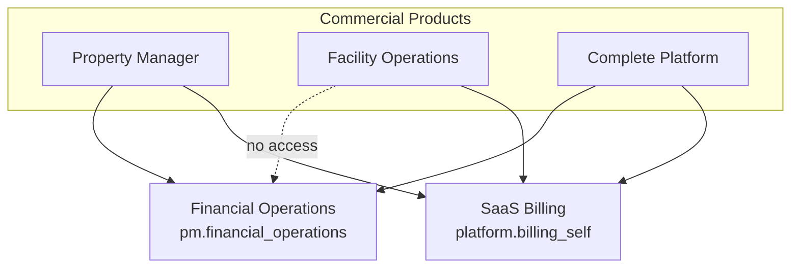
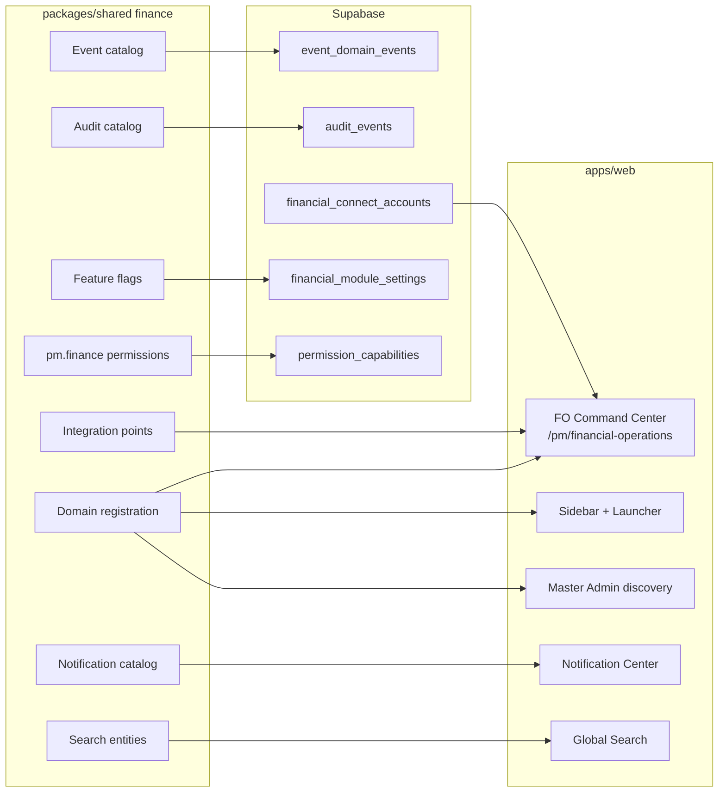
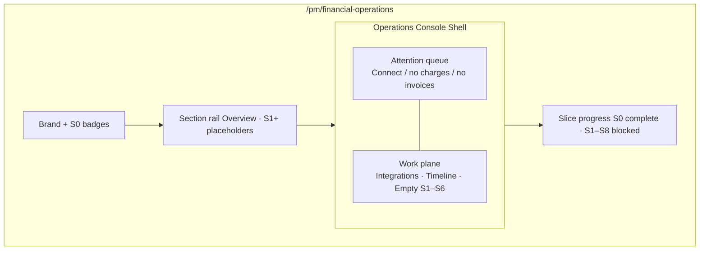
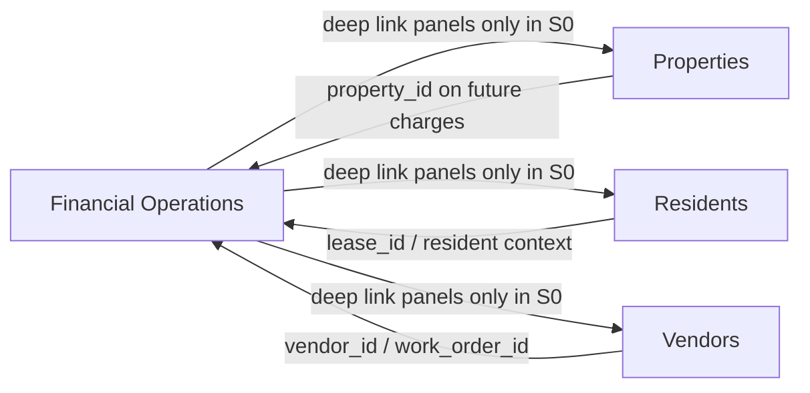
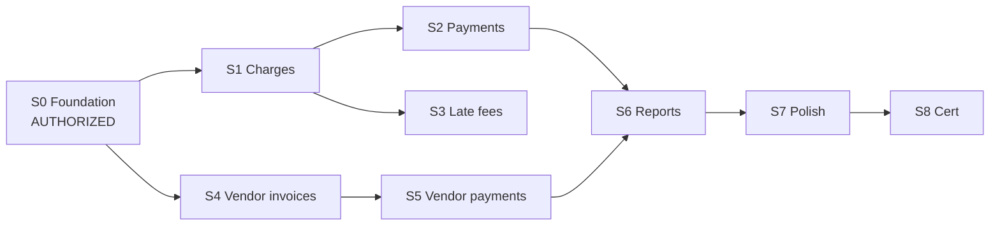

# S0 Architecture Diagrams — Financial Operations Foundation

**Slice:** FIN-OPS-001 S0  
**Date:** 2026-08-06

---

## 1. Commercial placement

---

## 2. S0 foundation stack

---

## 3. Command Center (STD-001 / Operations Console)

---

## 4. Integration points (no duplicate money systems)

---

## 5. Slice boundary

S1–S8 require separate `AUTHORIZE FIN-OPS-001 SLICE Sn` messages.
