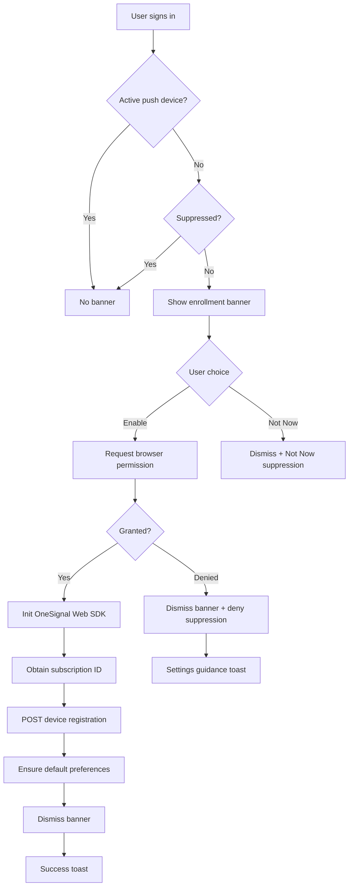
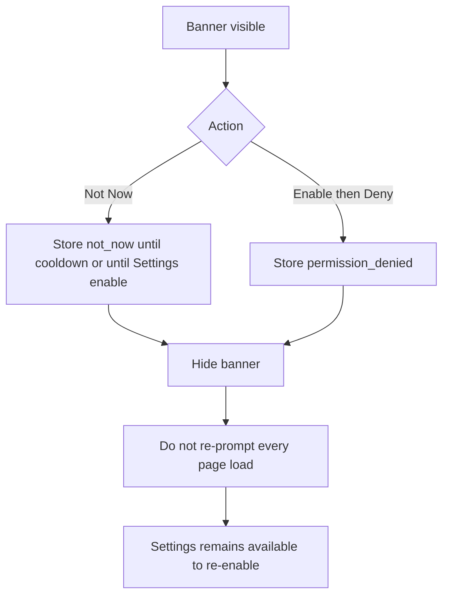

# 02 — User Enrollment Flow

**Package:** API-001A  
**Status:** Draft — Ready for Approval

---

## Intent

Guide authenticated users to opt into push **once**, with clear value, without blocking the product or nagging on every navigation.

---

## First-session / post-sign-in experience

### Trigger condition (all must be true)

1. User is authenticated.
2. Active organization context is resolved.
3. `NOTIFICATION_PROVIDER` is configured for real push **or** enrollment is allowed in a labeled dev mode (see provider notes below).
4. User has **no active** push device for `(organization_id, user_id)` (no `resident_devices` row with active subscription).
5. Enrollment prompt is **not suppressed** (see suppression rules).

### Banner (non-intrusive)

**Placement:** Application / portal shell — below primary header or as a dismissible strip in the main content column. **Not** a full-screen modal. **Not** a first-viewport marketing wall.

**Education copy (required):**

> Stay informed about maintenance updates, announcements, lease reminders, and emergencies.

**Actions:**

| Button | Behavior |
|--------|----------|
| **Enable Notifications** | Start permission → registration flow ([03](./03-device-registration.md)) |
| **Not Now** | Dismiss banner; apply suppression |

### Success copy

> Notifications enabled successfully.

### Denied copy

> You can enable notifications later in Settings.

---

## UX flow diagrams

### Happy path

### Permission denied / Not Now

---

## When NOT to prompt

Do **not** show the enrollment banner when any of the following apply:

| Condition | Rationale |
|-----------|-----------|
| Active device already registered | Already enrolled |
| `Notification.permission === "denied"` and suppression recorded | Browser will not show prompt; avoid useless CTA loops |
| User chose **Not Now** within cooldown | Respect dismissal |
| User chose **Not Now** and explicitly “don’t ask again” (if offered later) | Stronger suppression |
| Unauthenticated / no org | Cannot associate device |
| Role/plane where push is not applicable (if product defines) | Avoid noise |
| Provider is `noop` in production-like branding | Do not imply cloud push; optional quiet local-dev enrollment only behind explicit copy |
| User is mid-critical blocking flow (auth recovery, payment) | Defer until shell idle |

---

## Prompt timing rules

| Rule | Detail |
|------|--------|
| After auth hydration | Wait until session + org context stable (avoid flash for logged-out) |
| Once per eligible session wave | Evaluate once per shell mount after eligibility; not on every client navigation if already evaluated |
| Never before user gesture for Enable | Permission request runs only on **Enable** click (browser best practice) |
| Not on every page load after deny/Not Now | Suppression keys required |

---

## Suppression model (design)

Store client-persistent flags (localStorage or equivalent) **and** optionally server-side preference markers for cross-browser consistency of “Not Now” if product requires. Minimum for API-001A:

| Key | Meaning | Clear when |
|-----|---------|------------|
| `push_enroll_not_now_until` | Timestamp cooldown (recommended default: 7 days) | Expiry or Settings → Enable |
| `push_enroll_denied` | Permission denied on this browser | User changes browser permission + Settings → Enable |
| `push_enroll_completed` | Success on this browser (optional cache) | Device deactivated / re-register |

Server source of truth for “has device” remains `resident_devices`.

---

## Re-enable workflow

1. User opens **Notification Settings** ([04](./04-notification-settings.md)).
2. Chooses **Enable Push** or **Re-register Device**.
3. Same permission → register path as Enable on banner.
4. Clears relevant suppression keys on success.

If browser permission is still denied, Settings shows instructions to reset site permissions in the browser UI — M.P.A. cannot override OS/browser deny.

---

## Permission denied workflow

1. Banner dismisses immediately.
2. Show Settings guidance toast (denied copy).
3. Set deny suppression so shell does not re-show banner every load.
4. Preference `push_enabled` remains false unless already true from another device.
5. In-app notifications continue unaffected.

---

## Copy constraints (Canopy / Experience)

- One job: enroll for push awareness.
- No fear language (“you will miss emergencies” as guilt).
- Emergencies mentioned as value, not threat.
- No card stack of stats in the banner.
- Brand shell unchanged; banner is a secondary strip.

---

## Planes

| Plane | Enrollment |
|-------|------------|
| Resident / Tenant portal | Primary audience |
| Property Manager / Owner | Optional but recommended (ops alerts) |
| Vendor | Optional if product routes vendor push events |

Same banner pattern; Settings entry points differ by shell navigation.

---

## Relationship to existing preferences page

API-001 already exposes a preferences form and a push registration control. API-001A:

- Adds **shell-level enrollment** for discoverability
- Unifies success/deny/suppression rules
- Does **not** remove Settings; Settings becomes the durable management surface
