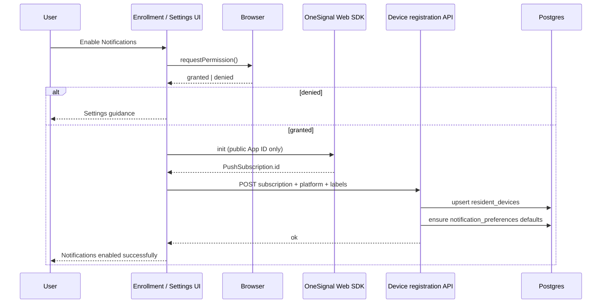

# 03 — Device Registration

**Package:** API-001A  
**Status:** Draft — Ready for Approval  
**Constraint:** Uses existing NotificationService / device APIs and OneSignal **client** subscription path. No redesign of OneSignalProvider send contract.

---

## Goal

Turn a granted browser permission into a durable, user-linked push subscription that NotificationService can target.

---

## Registration flow

---

## Steps (normative)

1. **User gesture** — Enable / Re-register only.
2. **Request permission** — `Notification.requestPermission` (via SDK or browser API consistent with existing client path).
3. **If granted** — Initialize OneSignal Web SDK with `NEXT_PUBLIC_ONESIGNAL_APP_ID` only; `allowLocalhostAsSecureOrigin` for local verification.
4. **Read subscription ID** — External subscription identifier from SDK.
5. **Register with M.P.A.** — Authenticated POST to existing devices endpoint:
   - `externalSubscriptionId`
   - `platform` (e.g. `web`)
   - `propertyId` when known (lease/property context)
   - `enrolledVia` (`onboarding_banner` | `settings` | `pwa` | `qr_join`)
   - `deviceLabel` (browser / friendly name)
6. **Persist** — Create/update `resident_devices` linked to `user_id` + `organization_id`; mark active.
7. **Preferences** — If no preferences row: create defaults with `push_enabled: true` after successful enroll; preserve existing prefs if present (only flip push on if product chooses — default: enable push on successful enroll).
8. **UI** — Dismiss enrollment banner; success message.

---

## Failure points (must be explicit in UX)

| Failure | User-visible outcome |
|---------|----------------------|
| Permission denied | Deny workflow ([02](./02-user-enrollment-flow.md)) |
| SDK init hang / timeout | Error: unable to initialize push; try again from Settings; do not infinite “Enabling…” |
| Missing public App ID | Error: push not configured; admin/setup guidance |
| Subscription ID null | Error: subscription not created; retry |
| API 401/403 | Error: session/permission; re-auth |
| API 5xx / network | Error: try again |
| Provider noop | Success may say “registered locally” — must not claim cloud push |

**Design note from live acceptance:** client must initialize `OneSignalDeferred` **before** loading the SDK script, await init with timeout, and never leave the CTA stuck without terminal state. This is a **client enrollment correctness** rule for API-001A implementation — not a change to server OneSignalProvider.

---

## Data association

| Field | Rule |
|-------|------|
| User | Always authenticated `user.id` — never client-supplied other user |
| Organization | Active org from session |
| Subscription | Unique per provider subscription; upsert on conflict |
| Active flag | New registration activates; prior same-browser row may deactivate or update in place |
| Last registration | Timestamp updated on every successful register |

---

## Device replacement

When the same browser re-registers:

1. Prefer **update in place** if device fingerprint / prior subscription maps to one row.
2. If subscription ID changed (browser reset), deactivate old subscription for that user+platform+label and insert/activate new.
3. Do not leave duplicate active rows for the identical browser session if detectable.

Cross-browser = multiple devices — see [08](./08-multi-device-strategy.md).

---

## Device removal / disable

| Action | Effect |
|--------|--------|
| Disable Push (Settings) | `push_enabled: false` and/or soft-deactivate devices; in-app continues |
| Remove / Deactivate device | Soft-deactivate row; stop targeting that subscription |
| Hard delete | Optional admin/privacy path; prefer soft-deactivate for audit |

Server send path (unchanged) already skips inactive / empty subscription lists.

---

## Token refresh / subscription lifecycle

| Event | Handling |
|-------|----------|
| SDK subscription change | Client should re-POST registration (Settings auto or silent refresh when app opens if permission granted) |
| Expired / invalid subscription on send | Provider failure recorded; Ops health increments failed deliveries; device may be marked unhealthy |
| Cleanup job (future) | Deactivate devices with repeated permanent provider failures |

API-001A designs the **client re-register** and **Ops visibility**; background cleanup may be a later slice if not already present.

---

## Security & privacy

- Client exposes only public App ID.
- Registration endpoint requires auth; RLS / service checks ensure self-only.
- Do not log full API keys; redact subscription IDs in client logs if verbose.
- Enrollment copy must not imply monitoring beyond property operations communications.

---

## Test notification (registration verification)

After a device is active, Settings **Send Test Notification** calls NotificationService for the current user (category `system`, low/normal priority) so verification uses the real pipeline:

`notify` → preferences → in-app row → provider → browser push → Notification Center.

No direct OneSignal calls from Settings UI business logic beyond the existing Web SDK used for subscription creation.
