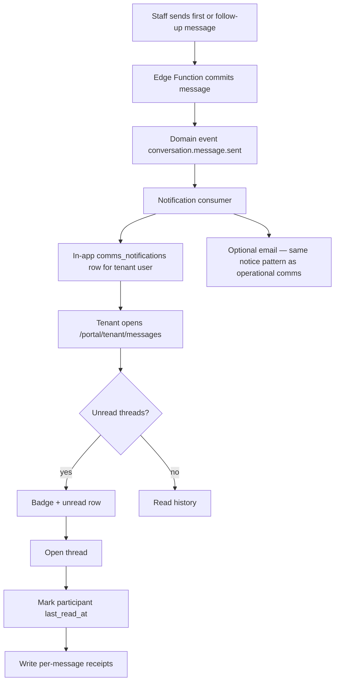
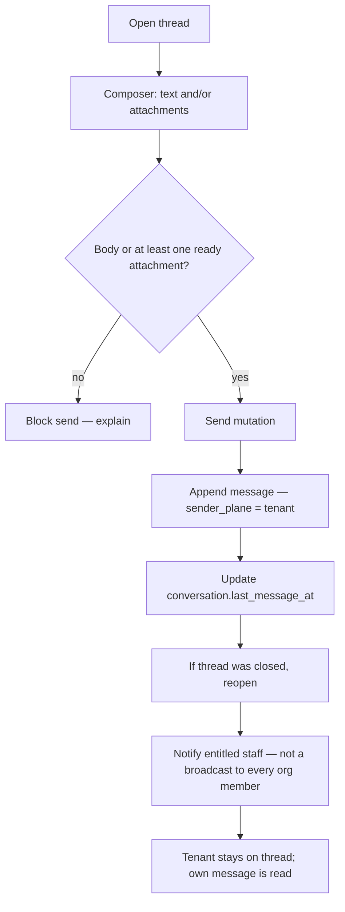
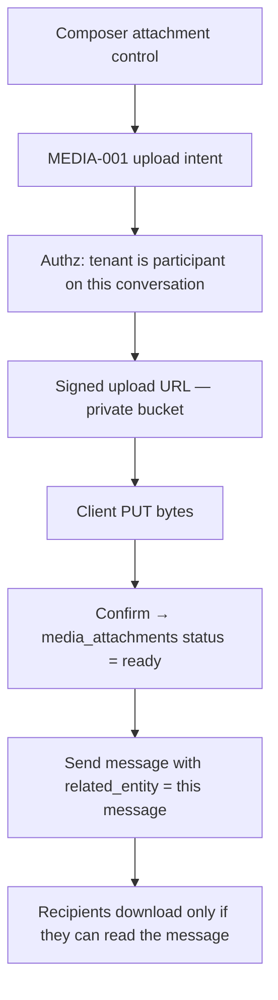
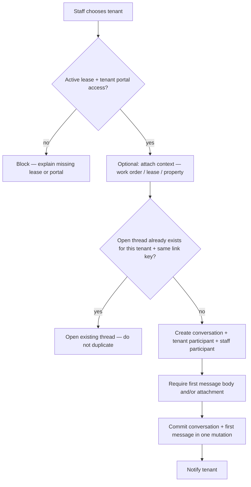

# 80 — COM-002 Tenant Communication Center

**Status:** Approved  
**Date:** 2026-08-14  
**Approved:** 2026-08-14 — Product Owner + Architect authorization to implement ADR-024 v1  
**Gate:** Design → Document → Approve → **Implement** (ADR-012)  
**Related ADR:** [ADR-024](../18-decision-log/adr-024-com-002-tenant-communication-center.md) (Accepted)  
**Production:** NO Production deploy from this package  
**Billing:** NO pricing, SKU, Stripe, or entitlement-key changes  

---

## Program identifier

| Field | Value |
|-------|--------|
| Program title | Tenant Communication Center |
| Requested code | COM-002 |
| Blueprint record | `docs/80-com-002-tenant-communication-center/` |
| ADR | ADR-024 |

**Collision notice.** The Blueprint already uses **COM-002** for Self-Service Commercial ([docs/37](../37-com-002-self-service-commercial/index.md), [ADR-018](../18-decision-log/adr-018-self-service-commercial-platform.md)). This record does **not** amend, replace, or reopen that commercial program. Until Product Owner assigns a unique communications program code, cite this work as **COM-002 Tenant Communication Center**, **ADR-024**, or **docs/80** — never as bare “COM-002”.

---

## Problem statement

Tenants and property managers need a durable, two-way place to talk: an inbox, a thread, history, attachments, and read state. Today M.P.A. has **one-way operational notices** (`comms_messages` + `comms_notifications` on `/shared/communications`) and a resident Messages surface that is honesty / empty-state only. Launch certification explicitly left **two-way threaded messaging** out of scope.

UX Principle 10 requires communication to stay attached to operational objects. An inbox may **aggregate** threads; it must not become a generic chat product divorced from lease, property, and work-order context.

This package designs the Tenant Communication Center. It stops at design.

---

## Goals

1. Tenant inbox: receive, reply, view history, attach files.  
2. Property manager desk: start a conversation, message a tenant, reply, view history.  
3. Two-way chat threads with durable message history.  
4. Attachments inside messages, reusing MEDIA-001 — no second file store.  
5. Read / unread for inbox and per-message receipts.  
6. Isolate tenants, organizations, and attachments.  
7. Link a thread to a work order (or lease / property) without inventing a second chat.  
8. Notify counterparts and write activity / audit events.  
9. Preserve Product Constitution, Implementation Gate, and existing one-way notices.

## Non-goals (this design package)

- Application code, UI components, Edge Functions, or scaffolding  
- Database migrations or RLS SQL  
- Production deploy or Preview feature flags that change live behavior  
- Billing, Stripe Prices, SaaS tiers, or new commercial products  
- Treating Enterprise as a product or pricing tier  
- Replacing `/shared/communications` operational notices  
- Owner-portal or vendor-portal threads  
- Multi-tenant group chat, SMS, WhatsApp, or social channels  
- AI chatbot / assistant chat (ADR-006)  
- Push / OneSignal blasts  
- Editing or unsending messages after commit  

---

## Constitution and product fit

| Rule | Application |
|------|-------------|
| Three products only | Tenant Communication Center is a **capability**, not a fourth product. |
| Property Manager | In scope — residential tenants. |
| Facility Operations | **No tenant inbox.** FO has no residential tenant plane. |
| Complete Platform | In scope as the **union** — same PM tenant-comms surfaces, no duplicate home. |
| Enterprise | Sales motion only. Must not appear as a product, SKU, or Confirm Plan option. |
| Commercial flow | Unchanged: Landing → Choose Product → Monthly / Annual → Stripe Checkout → Create Account → Guided Setup → Mission Control. |
| Entitlements | Reuse `platform.communications` and `pm.portal_tenant`. Do not invent customer-facing tiers. |

Canopy (Phase 1.5) and Experience Architecture (Phase 1.6) remain the visual and interaction authority. New UI, when later authorized, uses existing shells — not a new design language.

---

## Relationship to existing communications

| Surface | Role after this design | Reuse? |
|---------|------------------------|--------|
| `comms_messages` | Staff → resident / owner / vendor **one-way notices** | Keep. Do **not** reuse as the thread store. |
| `comms_notifications` | Unified in-app notification rows | Keep. Thread events write into this (or an equivalent source) so Notification Center stays one inbox. |
| `/shared/communications` | Notice composer + history | Keep. Add a **Conversations** desk beside notices — not a second product. |
| Resident Messages (Sprint 5) | Honesty / empty framing | Replace with the tenant inbox **only after Approve → Implement**. |
| MEDIA-001 `media_attachments` | Operational media | **Reuse** for in-message attachments. |
| `document_documents` | Org document vault | Optional **link**, not a second blob store. |

`docs/09` already reserves the `comms_` prefix for “message threads, notifications.” This design occupies that reserved thread domain.

---

## 1. User flows

Actors:

- **Tenant** — authenticated on the tenant plane (`tenant_lease_access` for an active lease).  
- **Property manager (staff)** — `org_members` in the lease’s organization, entitled for communications, scoped to the conversation’s property.

### 1.1 Tenant — receive a message



Tenant sees:

- Subject / preview, property + unit, optional work-order chip, timestamp, unread mark.  
- Thread opens with **context attached** (lease, property, linked work order) — Principle 10.  
- Empty inbox copy is honest: “No messages yet. Your property manager will appear here.”

### 1.2 Tenant — reply



Rules:

- Reply is always on the **same conversation**. No new thread per reply.  
- Tenant cannot add other tenants, owners, or vendors.  
- Tenant cannot start a thread in v1 unless Product Owner later authorizes “tenant-initiated.” Default: **staff starts**; tenant replies. See open question Q1.

### 1.3 Tenant — view history

- Chronological messages, oldest-first in the pane, newest at the bottom (standard chat).  
- Each message: sender display name, plane badge (You / Property team), timestamp, body, attachment gallery.  
- History is the conversation record — not a separate archive product. Closed threads remain readable.  
- Pagination: keyset on `created_at, id`. Design target: 50 messages per page.  
- Search inside one thread is v1 optional; inbox search by subject / tenant / property is staff-side v1.

### 1.4 Tenant — add attachment



- Reuse Canopy `MediaAttachmentField` (take photo / record short video / upload allowlisted types).  
- Draft media is invisible to the other party until the message is sent.  
- Failed uploads do not send. User may send text without the failed item.  
- Documents (PDF): **link** an existing Document Center record or defer — do not invent a third store. See §4.2.

### 1.5 Property manager — start conversation



Entry points (all the same model):

| Entry | Behavior |
|-------|----------|
| Conversations desk | Pick property → unit → tenant → optional subject → message. |
| Resident record | “Message tenant” pre-fills tenant + lease + property. |
| Work order | “Message tenant” sets `linked_entity_type = work_order`. |
| Lease record | Optional link to that lease. |

v1 conversation cardinality: **one tenant account ↔ one organization**, optionally keyed by linked entity. Staff-to-staff chat is out of scope.

### 1.6 Property manager — reply / message tenant / view history

- **Reply** uses the same composer and mutation as tenant reply; `sender_plane = staff`.  
- **Message tenant** from a resident or work-order surface either opens the existing thread or starts one (§1.5).  
- **View history** is the same chronological thread. Staff see which staff member sent each message (identity is recorded; the tenant sees a property-team label plus sender name).  
- Any entitled staff who can access the property may read and reply. The org is not a single anonymous mailbox — each message stores `sender_user_id`.  
- Closing a thread is a staff action (`status = closed`). A later send **reopens**. History is never deleted by close.

---

## 2. Architecture

### 2.1 Layering

```
Tenant portal (/portal/tenant/messages)
PM desk (/shared/communications conversations + contextual "Message tenant")
                    │
                    ▼
         Next.js read models (RLS)
         Edge Functions for mutations (ADR-007)
                    │
        ┌───────────┼──────────────┐
        ▼           ▼              ▼
 conversations   MEDIA-001     notifications
 + messages      attachments   + domain events
 + participants                + audit_events
 + reads
```

Reads may use authenticated Supabase + RLS. **Creates, replies, read-cursor updates, close/reopen, and attachment confirm-to-message** are business mutations and belong in Edge Functions (ADR-007). Do not write threads from the browser with the service role.

### 2.2 Conversation model

Logical entity `comms_conversations` (name reserved; **no migration in this package**).

| Field | Purpose |
|-------|---------|
| `id` | Stable thread id. |
| `organization_id` | Org isolation. Required. |
| `property_id` | Property scope for staff authorization. Required. |
| `lease_id` | Tenant plane scope. Required. |
| `tenant_account_id` | The one tenant on the thread. Required. |
| `subject` | Short label. Default from first message or linked entity (“Work order #…”, “Lease …”). |
| `status` | `open` \| `closed`. |
| `linked_entity_type` | Optional: `work_order` \| `lease` \| `property`. |
| `linked_entity_id` | Optional UUID of that entity. |
| `created_by_user_id` | Staff who started the thread (v1). |
| `created_at` / `updated_at` | Timestamps. |
| `last_message_at` | Inbox sort. |
| `last_message_preview` | Truncated plaintext for list rows. |

**Uniqueness (v1):** at most one **open-or-closed** conversation per `(organization_id, tenant_account_id, linked_entity_type, linked_entity_id)` treating null link as its own key. Starting “the same” conversation opens the existing row.

Conversations do not span organizations. Conversations do not include a second tenant.

### 2.3 Message model

Logical entity `comms_conversation_messages`.

| Field | Purpose |
|-------|---------|
| `id` | Message id. Attachment parent. |
| `conversation_id` | Parent thread. |
| `organization_id` | Denormalized for RLS. |
| `sender_user_id` | Auth user who sent. |
| `sender_plane` | `tenant` \| `staff`. |
| `body` | Plain text. Empty allowed only when at least one ready attachment exists. |
| `created_at` | Immutable send time. |
| `hidden_at` / `hidden_by` | Staff moderation only. Not a tenant unsend. |

v1 messages are **immutable** after commit. No edit. No tenant delete. Staff may hide a message for abuse; the hide is an audit event and the row remains.

This table is **not** `comms_messages`. Notices stay notices.

### 2.4 Participants

Logical entity `comms_conversation_participants`.

| Field | Purpose |
|-------|---------|
| `id` | Participant row. |
| `conversation_id` | Parent. |
| `organization_id` | Denormalized. |
| `participant_type` | `tenant` \| `staff`. |
| `user_id` | Auth user. |
| `tenant_account_id` | Set for tenant participants. |
| `added_at` | Join time. |
| `last_read_at` | Inbox unread cursor. |
| `muted_at` | Optional; suppresses notifications, not access. |

**v1 membership rules:**

1. Exactly one `tenant` participant — the lease’s tenant user.  
2. The starting staff user is a `staff` participant.  
3. Other entitled staff may read/reply **without** a prior participant row. Opening or sending **upserts** their participant row (desk-as-pool, identity-on-message).  
4. Owners, vendors, and other tenants are never participants in v1.  
5. Losing lease access or org membership **revokes** further reads even if a participant row remains.

### 2.5 Read receipts

Two layers — both required.

| Layer | Store | UX |
|-------|--------|-----|
| Inbox unread | `participant.last_read_at` | Thread is unread if `last_message_at > last_read_at` and the latest message is not from self. |
| Per-message receipt | `comms_message_reads` `(message_id, user_id, read_at)` | “Read” on a message when the **counterparty plane** has at least one receipt. |

Rules:

- Opening a thread sets `last_read_at = now()` and inserts receipts for messages the caller can see, excluding their own.  
- Tenant UX: a staff message is **Read** when any entitled staff participant has a receipt (desk-level). Optional later: “Read by Jordan Chen.”  
- Staff UX: a tenant message is **Read** when the tenant participant has a receipt.  
- Receipts are append-only. Clearing unread is not permitted.  
- Read events are **not** a fourth notification stream. They may emit a quiet domain event for audit; they do not ping the sender in v1.

### 2.6 Attachment relationship

```
comms_conversation_messages 1 ─── * media_attachments
  media.related_entity_type = 'conversation_message'
  media.related_entity_id   = message.id
  media.organization_id     = conversation.organization_id
```

| Rule | Decision |
|------|----------|
| Store | MEDIA-001 only. Private bucket. Signed URLs. No public URLs. |
| New entity type | Add `conversation_message` to MEDIA-001 `related_entity_type` **at implement time** (approved MEDIA-001 extension, not a new framework). |
| v1 MIME | Same allowlist as MEDIA-001 Phase 1: images + short video. |
| Documents | Optional `linked_document_id` on the message pointing at `document_documents` the caller can already read. No copy into a new bucket. |
| Lifecycle | Message hide does not physically delete media; MEDIA-001 soft-delete / retention applies. Conversation delete (if ever authorized) must not leave orphan signed paths readable. |
| Draft | `status = pending` until message send confirms; unsent drafts are not listed to the other party. |

Download authorization is **message authorization**. If the caller cannot `SELECT` the message, they cannot mint a signed URL. Path convention stays `{organization_id}/conversation_message/{message_id}/{media_id}/…`.

### 2.7 Audit events

Every mutation writes **both**:

1. `audit_events` / existing property audit helper (`writePropertyAudit`) — who, what, when, org, property.  
2. `event_domain_events` (`emitPropertyEvent` / ADR-005) — for notifications, work-order timeline, and future consumers.

| Event name | When | Payload (minimum) |
|------------|------|-------------------|
| `conversation.started` | Thread + first message committed | conversation_id, tenant_account_id, lease_id, property_id, linked_entity_* |
| `conversation.message.sent` | Each message | conversation_id, message_id, sender_plane, sender_user_id, has_attachments |
| `conversation.read` | Participant cursor advanced | conversation_id, user_id, last_read_at |
| `conversation.closed` / `conversation.reopened` | Status change | conversation_id, actor_user_id |
| `conversation.message.hidden` | Moderation | conversation_id, message_id, actor_user_id |
| `conversation.attachment.added` | Media confirmed on a sent message | conversation_id, message_id, media_id |

Audit rows include `organization_id` and `property_id`. Message **body is not copied** into the event payload (PII minimization). Consumers that need body read the message under RLS.

### 2.8 Proposed API contracts (design only)

| Mutation | Actor | Result |
|----------|-------|--------|
| `comms-start-conversation` | Staff | Conversation + first message + tenant notify |
| `comms-send-message` | Staff or tenant participant | Append + notify counterparties |
| `comms-mark-read` | Staff or tenant participant | Cursor + receipts |
| `comms-close-conversation` | Staff | `status = closed` |
| MEDIA-001 upload/confirm | Same as today, entity type `conversation_message` | Attachment rows |

Idempotency keys on start/send. Rate limit per user and per org (security standards).

Read models: list conversations for the caller’s plane; get thread + messages + media; get unread count for chrome badges.

---

## 3. Security design

Fail closed at every layer. UI hiding is not authorization (docs/14).

### 3.1 Tenant isolation

| Control | Rule |
|---------|------|
| Plane | Tenant plane only. Tenants are **not** `org_members` (ADR-003). |
| Access table | `tenant_lease_access` for `conversation.lease_id` and `conversation.tenant_account_id`. |
| Lease state | v1: active (and, if Product Owner confirms, recently ended lease for history-only). No access via a neighbor’s lease. |
| Row scope | Tenant `SELECT`s conversations where they are the tenant participant **and** lease access is valid. |
| Cross-tenant | Tenant A cannot list, guess, or subscribe to Tenant B’s conversation ids. IDs are unguessable UUIDs **and** RLS still applies. |
| Start | Tenant cannot create a thread with a different tenant or with staff at another org. |
| Portal | Routes under `/portal/tenant/…` only. No PM desk chrome. |

### 3.2 Property manager access boundaries

| Control | Rule |
|---------|------|
| Plane | PM organization (`org_members`). |
| Entitlement | Org must have `platform.communications` **and** `pm.portal_tenant` (Complete inherits via union). |
| Permission | Staff user needs communications read/write appropriate to the action. Viewers do not send. |
| Property scope | Staff may open a thread only if they can already access `conversation.property_id` (same property ACL as residents / work orders). |
| Lease scope | The tenant must belong to that property’s lease. No “message any email.” |
| Identity | Every staff message stores `sender_user_id`. The desk is shared; accountability is individual. |
| Moderation | Hide-message and close are staff-only. |
| FO staff | Facility Operations membership alone does **not** grant tenant inbox access. Complete users acting in the PM workspace follow PM rules. |
| Master Admin | Operator OS may support/break-glass per existing admin policy; not a participant and not a product surface. |

### 3.3 Organization isolation

| Control | Rule |
|---------|------|
| Column | `organization_id` on conversations, participants, messages, reads, notifications, events, and media. |
| RLS | Every table. No “internal” exception. |
| Cross-org | Org A staff cannot read Org B threads even if they know the UUID. |
| Storage paths | Prefixed by `organization_id`. Signed URLs minted only after org + message authz. |
| Notifications | `comms_notifications.organization_id` + `user_id` — never fan-out across orgs. |
| Service role | Edge Functions and workers only. |

### 3.4 Attachment authorization

| Check | Must pass |
|-------|-----------|
| Upload intent | Authenticated; caller can send on the conversation; MIME/size allowlist; org quota. |
| Confirm | Object exists; caller still a valid participant; bind to `message_id` only at send. |
| List / download | Caller can `SELECT` the parent message **now** (not merely “uploaded it once”). |
| Tenant after move-out | If lease access is revoked, signed URL minting fails even if the browser cached an old href (TTL ≤ 15 minutes). |
| Staff after losing property access | Same — current ACL, not historical uploader rights. |
| Direct storage URL | Forbidden. No public bucket. No long-lived URL in email. Email may say “View in M.P.A.” |
| Document links | Resolve `document_documents` under existing document ACL; do not widen document access because it was mentioned in a thread. |

### 3.5 Additional controls

- Zod-validate all mutation inputs.  
- Rate-limit send and upload.  
- Virus / quarantine path stays on MEDIA-001 (`quarantined` / `failed` never shown as ready).  
- Message bodies are PII; retention follows org data-lifecycle policy (docs/09).  
- RLS tests required before any future implement merge: authorized tenant, other tenant, other org, staff without property, FO-only user, signed-out.

---

## 4. Integration

### 4.1 Work order conversation linking

Work orders do not get a second chat system.

| Rule | Decision |
|------|----------|
| Link | `linked_entity_type = work_order`, `linked_entity_id = work_order.id`. |
| Start from WO | “Message tenant” on the work-order detail (PM). Reuses §1.5 uniqueness. |
| Context chip | Thread header and inbox row show work-order number + status. Click opens the WO the caller is allowed to see. |
| Tenant | Sees the same chip if they can access that maintenance request on the tenant portal; otherwise they still see the thread text. |
| Timeline | `conversation.message.sent` with this link is a work-order activity item (“Message sent to tenant”). |
| Cardinality | One thread per org + tenant + that work order. General (unlinked) threads remain available. |
| FO work orders | No tenant thread. Residential / PM maintenance only unless a later approved design extends Complete union carefully. |
| Notices | One-way `comms_messages` may still announce status. They are not thread replies. |

### 4.2 MEDIA-001 reuse

Do not design a parallel uploader, bucket, or attachment table.

| MEDIA-001 piece | COM-002 Tenant Communication Center use |
|-----------------|----------------------------------------|
| `media_attachments` | Parent = conversation message. |
| Private bucket + signed URLs | Same. |
| `MediaAttachmentField` | Composer + review gallery. |
| Allowlist / size / video length | Same Phase 1 limits unless a later MEDIA change is approved. |
| Constraint change | Add `conversation_message` to `related_entity_type` at implement. That is a **documented MEDIA-001 extension**, not a new framework. |
| Document vault | Optional link only. PDF-as-blob in MEDIA-001 is **out of v1** (MEDIA-001 file_type is image \| video). |

If product later requires PDF-in-thread as a first-class blob, that is a **material MEDIA-001 change** and restarts Design → Document → Approve for MEDIA — it is not silently in this package.

### 4.3 Notification integration

| Channel | v1 |
|---------|----|
| In-app | Write `comms_notifications` (or the same unified Notification Center source) for the counterpart user(s). `href` = thread URL. `notification_key` idempotent per message. |
| Email | Optional, reuse operational notice email helper. Body is a short preview + deep link. No attachment bytes in email. |
| Push / SMS / OneSignal | Out of v1. |
| Staff fan-out | Notify staff who are already participants **or** a small property-scoped watch list. Do **not** email every org member. Exact watch-list rule is Q2. |
| Read receipts | Do not create notifications. |
| Fourth inbox | Forbidden. Tenant inbox is threads; Notification Center is alerts that point at threads. |

Consumer is an ADR-005 event handler, not a synchronous email call buried in the UI.

### 4.4 Activity timeline integration

| Surface | What appears |
|---------|----------------|
| Property / resident activity | `conversation.started`, `conversation.message.sent` (no body). |
| Work-order timeline | Same events when `linked_entity_type = work_order`. |
| Audit log (expert disclosure) | Full actor, conversation id, message id, hide/close. |
| Domain event log | Replay / notification / future AI consumers (read-only). |

Timeline items deep-link to the thread for callers who still have access; otherwise the item stays visible as an opaque “Message activity” with no body and no attachment.

---

## 5. Surfaces (post-Approve, not built now)

| Actor | Route (proposed) | Notes |
|-------|------------------|-------|
| Tenant inbox | `/portal/tenant/messages` | List + unread. |
| Tenant thread | `/portal/tenant/messages/[conversationId]` | History + composer. |
| Staff desk | Conversations tab beside existing notices on `/shared/communications` | Same Shared Platform home — not a new product nav root. |
| Staff thread | `/shared/communications/conversations/[conversationId]` | History + composer + context chips. |
| Contextual | Resident, lease, work-order “Message tenant” | Opens or starts the same model. |

IA must not add Enterprise, Starter, Pro, or Teams. Facility Operations nav does not gain a tenant inbox.

---

## 6. Experience notes (Canopy)

- Operational Canopy — not marketing cards.  
- Inbox is an **action queue** (unread first), then history (Principle 2).  
- Context header pinned: property, unit, tenant / “Property team”, linked work order (Principles 3 and 10).  
- Progressive disclosure: list → thread → audit (staff).  
- Honest empty states. No fake community product.  
- Accessibility: focus order in composer, attachment names announced, unread not color-only.

---

## 7. Open questions (resolve at Approve)

| ID | Question | Default if silent |
|----|----------|-------------------|
| Q1 | May a tenant **start** a thread, or only reply? | Staff starts; tenant replies. |
| Q2 | Which staff receive the in-app/email ping? | Participants + conversation creator; not the whole org. |
| Q3 | After lease end, is history readable to the former tenant? | History-only for a defined window if `tenant_lease_access` still grants read; otherwise staff-only. |
| Q4 | Show individual staff names to the tenant? | Yes — sender display name + “Property team”. |
| Q5 | Unique communications program code to replace colliding COM-002? | Keep title as requested; cite docs/80 + ADR-024. |

---

## 8. Approval gate

| Gate | Owner | This package |
|------|-------|----------------|
| Design | Engineering | Done in this record. |
| Document | Blueprint + ADR | Done — `docs/80` + ADR-024 Proposed. |
| Approve | Product Owner + Architect | **Done** — 2026-08-14. |
| Implement | Engineering | Authorized for approved v1 only. See [docs/81](../81-com-002-implementation-certification/index.md). |

Implement **only** the approved v1 scope. Material changes (PDF blobs, tenant-initiated starts, owner/vendor threads, SMS, AI chat, billing) restart the gate. No Production deploy without a separate Owner authorization.

---

## 9. Related documents

- [ADR-024 COM-002 Tenant Communication Center](../18-decision-log/adr-024-com-002-tenant-communication-center.md)  
- [ADR-003 Four-plane authorization](../18-decision-log/adr-003-four-plane-authorization.md)  
- [ADR-005 Domain events](../18-decision-log/adr-005-domain-events.md)  
- [ADR-006 Embedded AI — not chatbot-first](../18-decision-log/adr-006-embedded-ai-not-chatbot.md)  
- [ADR-007 Edge Functions own mutations](../18-decision-log/adr-007-edge-functions-own-mutations.md)  
- [ADR-012 Implementation Gate](../18-decision-log/adr-012-design-document-approve-implement.md)  
- [ADR-019 Product Constitution](../18-decision-log/adr-019-product-constitution.md)  
- [ADR-023 MEDIA-001](../18-decision-log/adr-023-universal-media-attachment-framework.md)  
- [07 UX Principles — Principle 10](../07-ux-principles/index.md)  
- [09 Database Architecture](../09-database-architecture/index.md) (`comms_` prefix)  
- [14 Security Standards](../14-security-standards/index.md)  
- [24 Entitlement matrix](../24-product-architecture/entitlement-matrix.md)  
- [26 Launch remaining defects — two-way messaging out of scope](../26-launch-001-onboarding/production-certification/remaining-production-defects.md)  
- [55 Resident dashboard](../55-phase-4-resident-dashboard/index.md)  
- [73 MEDIA-001 design](../73-media-001-universal-media-attachment/index.md)  
- Commercial COM-002 (unrelated): [37](../37-com-002-self-service-commercial/index.md) · [ADR-018](../18-decision-log/adr-018-self-service-commercial-platform.md)
